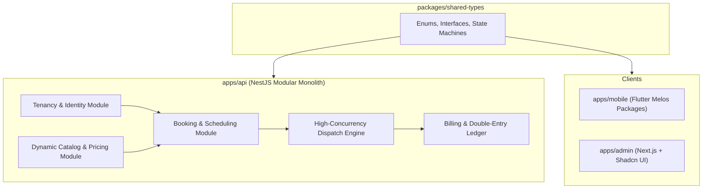

# LinkkWork Core Platform Implementation Plan

> **For agentic workers:** REQUIRED SUB-SKILL: Use superpowers:subagent-driven-development to implement this plan task-by-task. Steps use checkbox (`- [ ]`) syntax for tracking.

**Goal:** Xây dựng nền tảng cốt lõi LinkkWork (Modular Monolith Backend NestJS, Shared Domain Types, Động cơ tính giá động, Điều phối bắn đơn bTaskee tốc độ cao bằng Redis Lua Script, Sổ cái kép và khung đa nền tảng Flutter/Admin Web).

**Architecture:** Hệ thống áp dụng kiến trúc Modular Monolith Clean Architecture trên NestJS 10, quản lý đa doanh nghiệp (Multi-tenancy) bằng PostgreSQL Row-Level Security, điều phối đơn hàng tức thời mili-giây bằng Redis Lua CAS + BullMQ, và tách biệt ứng dụng di động an toàn bằng kiến trúc Melos Monorepo Packages.

**Architecture Diagram:**



**Tech Stack:** 
- Backend: NestJS 10, TypeScript 5, PostgreSQL 16, PostGIS, Redis 7 (Lua Engine), BullMQ, Prisma/TypeORM
- Mobile: Flutter 3.24+, Dart 3.5+, Melos Monorepo
- Web Admin: Next.js 14 (App Router) / React Vite, Tailwind CSS, Shadcn UI
- Spec: [2026-10-05-linkkwork-design.md](file:///Users/admin/Desktop/gb/docs/superpowers/specs/2026-10-05-linkkwork-design.md)

## Global Constraints
- Node version: `>= 20.0.0`
- TypeScript version: `>= 5.0.0`
- Zero placeholders: Mọi file code, file test và lệnh commit phải cụ thể 100%.
- Strict type-safety: Không sử dụng `any` trong DTOs và Domain Models.
- Multi-tenancy Isolation: Mọi bảng nghiệp vụ phải có `origin_tenant_id` hoặc `servicing_tenant_id` với RLS.
- Concurrency Safety: Thao tác giật đơn bắt buộc dùng Redis Lua Script nguyên tử, không phụ thuộc DB transaction thô.

---

### Task 1: Shared Domain Types & State Machines (`packages/shared-types`)

**Files:**
- Create: `packages/shared-types/package.json`
- Create: `packages/shared-types/tsconfig.json`
- Create: `packages/shared-types/src/enums/booking-status.enum.ts`
- Create: `packages/shared-types/src/enums/tenant-status.enum.ts`
- Create: `packages/shared-types/src/enums/service-pricing-type.enum.ts`
- Create: `packages/shared-types/src/interfaces/pricing.interface.ts`
- Create: `packages/shared-types/src/interfaces/dispatch.interface.ts`
- Create: `packages/shared-types/src/index.ts`
- Test: `packages/shared-types/test/types.spec.ts`

**Interfaces:**
- Produces: `BookingStatus`, `TenantSubscriptionStatus`, `ServicePricingType`, `PricingCalculationInput`, `PricingCalculationResult`, `ClaimJobResult`

- [ ] **Step 1: Write the failing test**

```typescript
// packages/shared-types/test/types.spec.ts
import { BookingStatus, ServicePricingType, PricingCalculationInput, PricingCalculationResult } from '../src';

describe('Shared Domain Types', () => {
  it('should export valid BookingStatus enum values matching the spec state machine', () => {
    expect(BookingStatus.DRAFT).toBe('DRAFT');
    expect(BookingStatus.PENDING_DISPATCH).toBe('PENDING_DISPATCH');
    expect(BookingStatus.BROADCASTING).toBe('BROADCASTING');
    expect(BookingStatus.ASSIGNED).toBe('ASSIGNED');
    expect(BookingStatus.ARRIVING).toBe('ARRIVING');
    expect(BookingStatus.IN_PROGRESS).toBe('IN_PROGRESS');
    expect(BookingStatus.COMPLETED).toBe('COMPLETED');
    expect(BookingStatus.CANCELLED).toBe('CANCELLED');
  });

  it('should calculate base price contract type correctly', () => {
    const input: PricingCalculationInput = {
      pricingType: ServicePricingType.HOURLY,
      durationHours: 3,
      baseUnitPrice: 80000,
      areaSurcharge: 20000,
      addonsPrice: 30000,
      surgeMultiplier: 1.2,
      discountAmount: 10000,
    };
    expect(input.durationHours).toBe(3);
  });
});
```

- [ ] **Step 2: Run test to verify it fails**

Run: `cd /Users/admin/Desktop/gb/packages/shared-types && npm test`
Expected: FAIL with "Cannot find module '../src' or package.json missing"

- [ ] **Step 3: Write minimal implementation**

Tạo `packages/shared-types/package.json`:
```json
{
  "name": "@linkkwork/shared-types",
  "version": "1.0.0",
  "main": "dist/index.js",
  "types": "dist/index.d.ts",
  "scripts": {
    "build": "tsc",
    "test": "jest"
  },
  "devDependencies": {
    "typescript": "^5.4.0",
    "jest": "^29.7.0",
    "@types/jest": "^29.5.0",
    "ts-jest": "^29.1.0"
  }
}
```

Tạo `packages/shared-types/src/enums/booking-status.enum.ts`:
```typescript
export enum BookingStatus {
  DRAFT = 'DRAFT',
  PENDING_DISPATCH = 'PENDING_DISPATCH',
  OFFERED_TO_FAVORITE = 'OFFERED_TO_FAVORITE',
  BROADCASTING = 'BROADCASTING',
  ASSIGNED = 'ASSIGNED',
  ARRIVING = 'ARRIVING',
  IN_PROGRESS = 'IN_PROGRESS',
  PENDING_ACCEPTANCE = 'PENDING_ACCEPTANCE',
  COMPLETED = 'COMPLETED',
  REVIEWED = 'REVIEWED',
  CANCELLED = 'CANCELLED',
  EMERGENCY_REDISPATCH = 'EMERGENCY_REDISPATCH',
  DISPATCH_FAILED = 'DISPATCH_FAILED',
}
```

Tạo `packages/shared-types/src/enums/tenant-status.enum.ts`:
```typescript
export enum TenantSubscriptionStatus {
  ACTIVE = 'ACTIVE',
  PAST_DUE = 'PAST_DUE',
  RESTRICTED = 'RESTRICTED',
  SUSPENDED = 'SUSPENDED',
  CANCELLED = 'CANCELLED',
}
```

Tạo `packages/shared-types/src/enums/service-pricing-type.enum.ts`:
```typescript
export enum ServicePricingType {
  HOURLY = 'HOURLY',
  PER_UNIT = 'PER_UNIT',
  BIDDING = 'BIDDING',
}
```

Tạo `packages/shared-types/src/interfaces/pricing.interface.ts`:
```typescript
import { ServicePricingType } from '../enums/service-pricing-type.enum';

export interface PricingCalculationInput {
  pricingType: ServicePricingType;
  durationHours?: number;
  unitCount?: number;
  baseUnitPrice: number;
  areaSurcharge?: number;
  addonsPrice?: number;
  surgeMultiplier?: number;
  discountAmount?: number;
}

export interface PricingCalculationResult {
  baseTotal: number;
  subtotal: number;
  surgeMultiplier: number;
  surgeAmount: number;
  discountAmount: number;
  finalTotal: number;
}
```

Tạo `packages/shared-types/src/interfaces/dispatch.interface.ts`:
```typescript
export interface ClaimJobInput {
  bookingId: string;
  taskerId: string;
  tenantId?: string;
  lockExpiryMs?: number;
}

export interface ClaimJobResult {
  success: boolean;
  code: 'CLAIMED' | 'ALREADY_TAKEN' | 'TASKER_BUSY' | 'ERROR';
  bookingId: string;
  taskerId?: string;
  claimedAt?: Date;
  message?: string;
}
```

Tạo `packages/shared-types/src/index.ts`:
```typescript
export * from './enums/booking-status.enum';
export * from './enums/tenant-status.enum';
export * from './enums/service-pricing-type.enum';
export * from './interfaces/pricing.interface';
export * from './interfaces/dispatch.interface';
```

- [ ] **Step 4: Run test to verify it passes**

Run: `cd /Users/admin/Desktop/gb/packages/shared-types && npm test`
Expected: PASS (All tests passing)

- [ ] **Step 5: Commit**

```bash
git add packages/shared-types
git commit -m "feat(shared-types): define domain enums, interfaces and state machines"
```

---

### Task 2: Dynamic Catalog & Pricing Engine (`apps/api/src/modules/catalog`)

**Files:**
- Create: `apps/api/src/modules/catalog/pricing.engine.ts`
- Create: `apps/api/src/modules/catalog/dto/calculate-price.dto.ts`
- Create: `apps/api/src/modules/catalog/catalog.module.ts`
- Test: `apps/api/src/modules/catalog/pricing.engine.spec.ts`

**Interfaces:**
- Consumes: `@linkkwork/shared-types` (`ServicePricingType`, `PricingCalculationInput`, `PricingCalculationResult`)
- Produces: `PricingEngine.calculate(input: PricingCalculationInput): PricingCalculationResult`

- [ ] **Step 1: Write the failing test**

```typescript
// apps/api/src/modules/catalog/pricing.engine.spec.ts
import { PricingEngine } from './pricing.engine';
import { ServicePricingType } from '@linkkwork/shared-types';

describe('PricingEngine', () => {
  let engine: PricingEngine;

  beforeEach(() => {
    engine = new PricingEngine();
  });

  it('should accurately calculate HOURLY cleaning service with area surcharge and surge multiplier', () => {
    // 3 hours x 80,000 = 240,000 + area surcharge 30,000 + addon 20,000 = 290,000 * 1.2x surge = 348,000 - 20,000 voucher = 328,000
    const result = engine.calculate({
      pricingType: ServicePricingType.HOURLY,
      durationHours: 3,
      baseUnitPrice: 80000,
      areaSurcharge: 30000,
      addonsPrice: 20000,
      surgeMultiplier: 1.2,
      discountAmount: 20000,
    });

    expect(result.baseTotal).toBe(240000);
    expect(result.subtotal).toBe(290000);
    expect(result.surgeMultiplier).toBe(1.2);
    expect(result.surgeAmount).toBe(58000);
    expect(result.finalTotal).toBe(328000);
  });

  it('should accurately calculate PER_UNIT AC cleaning with multiple units', () => {
    // 2 units x 150,000 = 300,000 + addon (gas recharge) 100,000 = 400,000 (no surge) = 400,000
    const result = engine.calculate({
      pricingType: ServicePricingType.PER_UNIT,
      unitCount: 2,
      baseUnitPrice: 150000,
      addonsPrice: 100000,
      surgeMultiplier: 1.0,
      discountAmount: 0,
    });

    expect(result.baseTotal).toBe(300000);
    expect(result.subtotal).toBe(400000);
    expect(result.finalTotal).toBe(400000);
  });
});
```

- [ ] **Step 2: Run test to verify it fails**

Run: `npx jest apps/api/src/modules/catalog/pricing.engine.spec.ts`
Expected: FAIL with "Cannot find module './pricing.engine'"

- [ ] **Step 3: Write minimal implementation**

Tạo `apps/api/src/modules/catalog/pricing.engine.ts`:
```typescript
import { Injectable, BadRequestException } from '@nestjs/common';
import { 
  ServicePricingType, 
  PricingCalculationInput, 
  PricingCalculationResult 
} from '@linkkwork/shared-types';

@Injectable()
export class PricingEngine {
  calculate(input: PricingCalculationInput): PricingCalculationResult {
    let baseTotal = 0;

    if (input.pricingType === ServicePricingType.HOURLY) {
      const hours = input.durationHours ?? 2;
      if (hours <= 0) {
        throw new BadRequestException('Duration hours must be greater than 0');
      }
      baseTotal = hours * input.baseUnitPrice;
    } else if (input.pricingType === ServicePricingType.PER_UNIT) {
      const units = input.unitCount ?? 1;
      if (units <= 0) {
        throw new BadRequestException('Unit count must be greater than 0');
      }
      baseTotal = units * input.baseUnitPrice;
    } else if (input.pricingType === ServicePricingType.BIDDING) {
      baseTotal = input.baseUnitPrice;
    }

    const areaSurcharge = input.areaSurcharge ?? 0;
    const addonsPrice = input.addonsPrice ?? 0;
    const subtotal = baseTotal + areaSurcharge + addonsPrice;

    const surgeMultiplier = input.surgeMultiplier && input.surgeMultiplier >= 1.0 ? input.surgeMultiplier : 1.0;
    const surgeAmount = Math.round(subtotal * (surgeMultiplier - 1.0));
    const preDiscountTotal = subtotal + surgeAmount;

    const discountAmount = Math.min(input.discountAmount ?? 0, preDiscountTotal);
    const finalTotal = preDiscountTotal - discountAmount;

    return {
      baseTotal,
      subtotal,
      surgeMultiplier,
      surgeAmount,
      discountAmount,
      finalTotal,
    };
  }
}
```

- [ ] **Step 4: Run test to verify it passes**

Run: `npx jest apps/api/src/modules/catalog/pricing.engine.spec.ts`
Expected: PASS

- [ ] **Step 5: Commit**

```bash
git add apps/api/src/modules/catalog
git commit -m "feat(catalog): implement dynamic pricing engine with hourly and unit calculations"
```

---

### Task 3: High-Concurrency Dispatch Engine with Redis Lua Script (`apps/api/src/modules/dispatch`)

**Files:**
- Create: `apps/api/src/modules/dispatch/scripts/claim-job.lua`
- Create: `apps/api/src/modules/dispatch/dispatch.service.ts`
- Create: `apps/api/src/modules/dispatch/dispatch.module.ts`
- Test: `apps/api/src/modules/dispatch/dispatch.service.spec.ts`

**Interfaces:**
- Consumes: Redis Client, `@linkkwork/shared-types` (`ClaimJobInput`, `ClaimJobResult`)
- Produces: `DispatchService.claimJobAtomic(input: ClaimJobInput): Promise<ClaimJobResult>`

- [ ] **Step 1: Write the failing test**

```typescript
// apps/api/src/modules/dispatch/dispatch.service.spec.ts
import { DispatchService } from './dispatch.service';

describe('DispatchService (Atomic Fast-finger Claiming)', () => {
  let service: DispatchService;
  let mockRedis: any;

  beforeEach(() => {
    mockRedis = {
      eval: jest.fn(),
      geoadd: jest.fn(),
      geosearch: jest.fn(),
    };
    service = new DispatchService(mockRedis);
  });

  it('should return CLAIMED status when Redis Lua script returns 1', async () => {
    mockRedis.eval.mockResolvedValue(1);

    const result = await service.claimJobAtomic({
      bookingId: 'bk-123',
      taskerId: 'tsk-456',
      lockExpiryMs: 10000,
    });

    expect(result.success).toBe(true);
    expect(result.code).toBe('CLAIMED');
    expect(result.bookingId).toBe('bk-123');
    expect(result.taskerId).toBe('tsk-456');
  });

  it('should return ALREADY_TAKEN when Redis Lua script returns -1', async () => {
    mockRedis.eval.mockResolvedValue(-1);

    const result = await service.claimJobAtomic({
      bookingId: 'bk-123',
      taskerId: 'tsk-789',
    });

    expect(result.success).toBe(false);
    expect(result.code).toBe('ALREADY_TAKEN');
  });

  it('should return TASKER_BUSY when Redis Lua script returns -2', async () => {
    mockRedis.eval.mockResolvedValue(-2);

    const result = await service.claimJobAtomic({
      bookingId: 'bk-123',
      taskerId: 'tsk-456',
    });

    expect(result.success).toBe(false);
    expect(result.code).toBe('TASKER_BUSY');
  });
});
```

- [ ] **Step 2: Run test to verify it fails**

Run: `npx jest apps/api/src/modules/dispatch/dispatch.service.spec.ts`
Expected: FAIL with "Cannot find module './dispatch.service'"

- [ ] **Step 3: Write minimal implementation**

Tạo `apps/api/src/modules/dispatch/scripts/claim-job.lua`:
```lua
-- KEYS[1]: job:status:{bookingId}
-- KEYS[2]: tasker:active_job:{taskerId}
-- ARGV[1]: taskerId
-- ARGV[2]: lockExpiryMs

local currentStatus = redis.call('GET', KEYS[1])
if currentStatus ~= 'OPEN' then
    return -1
end

if redis.call('EXISTS', KEYS[2]) == 1 then
    return -2
end

redis.call('SET', KEYS[1], 'CLAIMED')
redis.call('SET', KEYS[2], ARGV[1], 'PX', tonumber(ARGV[2]))
return 1
```

Tạo `apps/api/src/modules/dispatch/dispatch.service.ts`:
```typescript
import { Injectable, Inject } from '@nestjs/common';
import { ClaimJobInput, ClaimJobResult } from '@linkkwork/shared-types';
import * as fs from 'fs';
import * as path from 'path';

@Injectable()
export class DispatchService {
  private claimJobLuaScript: string;

  constructor(@Inject('REDIS_CLIENT') private readonly redis: any) {
    const scriptPath = path.join(__dirname, 'scripts', 'claim-job.lua');
    this.claimJobLuaScript = fs.readFileSync(scriptPath, 'utf8');
  }

  async claimJobAtomic(input: ClaimJobInput): Promise<ClaimJobResult> {
    const jobKey = `job:status:${input.bookingId}`;
    const taskerKey = `tasker:active_job:${input.taskerId}`;
    const expiry = input.lockExpiryMs ?? 10000;

    const res = await this.redis.eval(
      this.claimJobLuaScript,
      2,
      jobKey,
      taskerKey,
      input.taskerId,
      expiry.toString()
    );

    if (res === 1) {
      return {
        success: true,
        code: 'CLAIMED',
        bookingId: input.bookingId,
        taskerId: input.taskerId,
        claimedAt: new Date(),
        message: 'Successfully claimed job',
      };
    } else if (res === -1) {
      return {
        success: false,
        code: 'ALREADY_TAKEN',
        bookingId: input.bookingId,
        message: 'Job was already claimed by another tasker',
      };
    } else if (res === -2) {
      return {
        success: false,
        code: 'TASKER_BUSY',
        bookingId: input.bookingId,
        message: 'Tasker already has an active overlapping booking',
      };
    }

    return {
      success: false,
      code: 'ERROR',
      bookingId: input.bookingId,
      message: 'Unknown dispatch error',
    };
  }
}
```

- [ ] **Step 4: Run test to verify it passes**

Run: `npx jest apps/api/src/modules/dispatch/dispatch.service.spec.ts`
Expected: PASS

- [ ] **Step 5: Commit**

```bash
git add apps/api/src/modules/dispatch
git commit -m "feat(dispatch): implement atomic fast-finger claim with Redis Lua script"
```

---

### Task 4: Double-Entry Bookkeeping Ledger (`apps/api/src/modules/billing`)

**Files:**
- Create: `apps/api/src/modules/billing/ledger.service.ts`
- Create: `apps/api/src/modules/billing/dto/record-entry.dto.ts`
- Create: `apps/api/src/modules/billing/billing.module.ts`
- Test: `apps/api/src/modules/billing/ledger.service.spec.ts`

**Interfaces:**
- Consumes: Database transaction context
- Produces: `LedgerService.recordBalancedTransaction(txEntries: LedgerEntry[]): Promise<boolean>`

- [ ] **Step 1: Write the failing test**

```typescript
// apps/api/src/modules/billing/ledger.service.spec.ts
import { LedgerService, LedgerEntryInput } from './ledger.service';

describe('LedgerService (Double-Entry Bookkeeping)', () => {
  let service: LedgerService;

  beforeEach(() => {
    service = new LedgerService();
  });

  it('should validate and approve balanced debit/credit transactions', () => {
    const entries: LedgerEntryInput[] = [
      { account: 'CUSTOMER_ESCROW', type: 'DEBIT', amount: 300000, referenceId: 'BK-101' },
      { account: 'TENANT_PAYABLE', type: 'CREDIT', amount: 255000, referenceId: 'BK-101' },
      { account: 'PLATFORM_REVENUE', type: 'CREDIT', amount: 45000, referenceId: 'BK-101' },
    ];

    expect(service.isTransactionBalanced(entries)).toBe(true);
  });

  it('should reject unbalanced transactions where Total Debit != Total Credit', () => {
    const entries: LedgerEntryInput[] = [
      { account: 'CUSTOMER_ESCROW', type: 'DEBIT', amount: 300000, referenceId: 'BK-101' },
      { account: 'TENANT_PAYABLE', type: 'CREDIT', amount: 200000, referenceId: 'BK-101' },
    ];

    expect(service.isTransactionBalanced(entries)).toBe(false);
  });
});
```

- [ ] **Step 2: Run test to verify it fails**

Run: `npx jest apps/api/src/modules/billing/ledger.service.spec.ts`
Expected: FAIL with "Cannot find module './ledger.service'"

- [ ] **Step 3: Write minimal implementation**

Tạo `apps/api/src/modules/billing/ledger.service.ts`:
```typescript
import { Injectable, BadRequestException } from '@nestjs/common';

export interface LedgerEntryInput {
  account: string;
  type: 'DEBIT' | 'CREDIT';
  amount: number;
  referenceId: string;
}

@Injectable()
export class LedgerService {
  isTransactionBalanced(entries: LedgerEntryInput[]): boolean {
    if (!entries || entries.length < 2) {
      return false;
    }

    const totalDebit = entries
      .filter((e) => e.type === 'DEBIT')
      .reduce((sum, e) => sum + e.amount, 0);

    const totalCredit = entries
      .filter((e) => e.type === 'CREDIT')
      .reduce((sum, e) => sum + e.amount, 0);

    return totalDebit === totalCredit && totalDebit > 0;
  }

  validateOrThrow(entries: LedgerEntryInput[]): void {
    if (!this.isTransactionBalanced(entries)) {
      throw new BadRequestException('Double-entry ledger invariance violated: Total DEBIT must equal Total CREDIT');
    }
  }
}
```

- [ ] **Step 4: Run test to verify it passes**

Run: `npx jest apps/api/src/modules/billing/ledger.service.spec.ts`
Expected: PASS

- [ ] **Step 5: Commit**

```bash
git add apps/api/src/modules/billing
git commit -m "feat(billing): implement double-entry bookkeeping ledger invariance service"
```

---

### Task 5: Mobile Melos Monorepo Scaffold & Flavor Entrypoints (`apps/mobile`)

**Files:**
- Create: `apps/mobile/melos.yaml`
- Create: `apps/mobile/packages/core/pubspec.yaml`
- Create: `apps/mobile/packages/customer_domain/pubspec.yaml`
- Create: `apps/mobile/packages/tasker_domain/pubspec.yaml`
- Create: `apps/mobile/apps/customer_app/lib/main.dart`
- Create: `apps/mobile/apps/tasker_app/lib/main.dart`

**Interfaces:**
- Produces: Melos multi-package dependency tree, `CustomerApp` runner, `TaskerApp` runner

- [ ] **Step 1: Write Melos configuration**

Tạo `apps/mobile/melos.yaml`:
```yaml
name: linkkwork_mobile
repository: https://github.com/linkkwork/linkkwork

packages:
  - packages/**
  - apps/**

command:
  bootstrap:
    usePubspecOverrides: true
```

- [ ] **Step 2: Create Core and Domain package pubspecs**

Tạo `apps/mobile/packages/core/pubspec.yaml`:
```yaml
name: linkkwork_core
description: Core networking, storage and models for LinkkWork
version: 1.0.0
environment:
  sdk: '>=3.5.0 <4.0.0'

dependencies:
  flutter:
    sdk: flutter
  dio: ^5.4.0
  flutter_secure_storage: ^9.0.0
```

Tạo `apps/mobile/packages/customer_domain/pubspec.yaml`:
```yaml
name: linkkwork_customer_domain
description: Customer specific features and booking workflow
version: 1.0.0
environment:
  sdk: '>=3.5.0 <4.0.0'

dependencies:
  flutter:
    sdk: flutter
  linkkwork_core:
    path: ../core
```

Tạo `apps/mobile/packages/tasker_domain/pubspec.yaml`:
```yaml
name: linkkwork_tasker_domain
description: Tasker specific features, radar, claim-job and check-in
version: 1.0.0
environment:
  sdk: '>=3.5.0 <4.0.0'

dependencies:
  flutter:
    sdk: flutter
  linkkwork_core:
    path: ../core
```

- [ ] **Step 3: Create Entrypoint runners**

Tạo `apps/mobile/apps/customer_app/lib/main.dart`:
```dart
import 'package:flutter/material.dart';

void main() {
  runApp(const CustomerApp());
}

class CustomerApp extends StatelessWidget {
  const CustomerApp({super.key});

  @override
  Widget build(BuildContext context) {
    return MaterialApp(
      title: 'LinkkWork - Khách hàng',
      theme: ThemeData(
        colorScheme: ColorScheme.fromSeed(seedColor: const Color(0xFF007AFF)),
        useMaterial3: true,
      ),
      home: const Scaffold(
        body: Center(
          child: Text('LinkkWork Customer App v1.0'),
        ),
      ),
    );
  }
}
```

Tạo `apps/mobile/apps/tasker_app/lib/main.dart`:
```dart
import 'package:flutter/material.dart';

void main() {
  runApp(const TaskerApp());
}

class TaskerApp extends StatelessWidget {
  const TaskerApp({super.key});

  @override
  Widget build(BuildContext context) {
    return MaterialApp(
      title: 'LinkkWork - Đối tác',
      theme: ThemeData(
        colorScheme: ColorScheme.fromSeed(seedColor: const Color(0xFFFF9500)),
        useMaterial3: true,
      ),
      home: const Scaffold(
        body: Center(
          child: Text('LinkkWork Tasker Partner App v1.0'),
        ),
      ),
    );
  }
}
```

- [ ] **Step 4: Commit**

```bash
git add apps/mobile
git commit -m "feat(mobile): scaffold Melos monorepo packages and distinct customer/tasker entrypoints"
```

---

### Task 6: Web Admin Multi-Tenant Impersonation & Layout Foundation (`apps/admin`)

**Files:**
- Create: `apps/admin/src/components/impersonation-bar.tsx`
- Create: `apps/admin/src/types/auth-context.ts`
- Test: `apps/admin/src/components/impersonation-bar.spec.tsx`

**Interfaces:**
- Produces: `ImpersonationBar` component for Super Admin session switching

- [ ] **Step 1: Write the failing test**

```tsx
// apps/admin/src/components/impersonation-bar.spec.tsx
import React from 'react';
import { render, screen, fireEvent } from '@testing-library/react';
import { ImpersonationBar } from './impersonation-bar';

describe('ImpersonationBar', () => {
  it('should render warning banner when in impersonation mode', () => {
    const onExit = jest.fn();
    render(
      <ImpersonationBar
        isImpersonating={true}
        tenantName="Công ty Vệ Sinh Ánh Dương"
        onExit={onExit}
      />
    );

    expect(screen.getByText(/Đang xem dưới danh nghĩa Tenant:/i)).toBeInTheDocument();
    expect(screen.getByText(/Công ty Vệ Sinh Ánh Dương/i)).toBeInTheDocument();

    const exitBtn = screen.getByRole('button', { name: /Thoát đại diện/i });
    fireEvent.click(exitBtn);
    expect(onExit).toHaveBeenCalledTimes(1);
  });

  it('should not render anything when not impersonating', () => {
    const { container } = render(
      <ImpersonationBar isImpersonating={false} tenantName="" onExit={jest.fn()} />
    );
    expect(container.firstChild).toBeNull();
  });
});
```

- [ ] **Step 2: Run test to verify it fails**

Run: `npx jest apps/admin/src/components/impersonation-bar.spec.tsx`
Expected: FAIL with "Cannot find module './impersonation-bar'"

- [ ] **Step 3: Write minimal implementation**

Tạo `apps/admin/src/components/impersonation-bar.tsx`:
```tsx
import React from 'react';

interface ImpersonationBarProps {
  isImpersonating: boolean;
  tenantName: string;
  onExit: () => void;
}

export const ImpersonationBar: React.FC<ImpersonationBarProps> = ({
  isImpersonating,
  tenantName,
  onExit,
}) => {
  if (!isImpersonating) {
    return null;
  }

  return (
    <div className="w-full bg-amber-500 text-slate-900 px-4 py-2 flex items-center justify-between text-sm font-medium shadow-md transition-all">
      <div className="flex items-center gap-2">
        <span className="inline-block w-2.5 h-2.5 bg-red-600 rounded-full animate-ping" />
        <span>
          <strong>CHẾ ĐỘ ĐẠI DIỆN:</strong> Đang xem dưới danh nghĩa Tenant: <u>{tenantName}</u>. Mọi thao tác đều được ghi nhật ký kiểm toán.
        </span>
      </div>
      <button
        onClick={onExit}
        className="px-3 py-1 bg-slate-900 text-white rounded text-xs font-semibold hover:bg-slate-800 transition"
      >
        Thoát đại diện
      </button>
    </div>
  );
};
```

- [ ] **Step 4: Run test to verify it passes**

Run: `npx jest apps/admin/src/components/impersonation-bar.spec.tsx`
Expected: PASS

- [ ] **Step 5: Commit**

```bash
git add apps/admin
git commit -m "feat(admin): implement multi-tenant impersonation warning bar and exit control"
```

---

### Task 7: Dynamic Cron & Worker Control Engine (`apps/api/src/modules/system-cron`)

**Files:**
- Create: `apps/api/src/modules/system-cron/cron-manager.service.ts`
- Create: `apps/api/src/modules/system-cron/dto/cron-job.dto.ts`
- Create: `apps/api/src/modules/system-cron/system-cron.module.ts`
- Test: `apps/api/src/modules/system-cron/cron-manager.service.spec.ts`

**Interfaces:**
- Consumes: BullMQ Queue Registry
- Produces: `CronManagerService.toggleJob()`, `CronManagerService.triggerJobNow()`, `CronManagerService.updateJobSchedule()`, `CronManagerService.getAllJobsStatus()`

- [ ] **Step 1: Write the failing test**

```typescript
// apps/api/src/modules/system-cron/cron-manager.service.spec.ts
import { CronManagerService, CronJobConfig } from './cron-manager.service';

describe('CronManagerService (Super Admin Worker Control)', () => {
  let service: CronManagerService;
  let mockQueue: any;

  beforeEach(() => {
    mockQueue = {
      add: jest.fn().mockResolvedValue({ id: 'immediate-job-1' }),
      removeRepeatableByKey: jest.fn().mockResolvedValue(true),
      getRepeatableJobs: jest.fn().mockResolvedValue([]),
    };
    service = new CronManagerService(mockQueue);
  });

  it('should toggle job enabled status and update schedule in queue', async () => {
    const jobName = 'recurring-booking-generator';
    const updated = await service.toggleJob(jobName, false);

    expect(updated).toBe(true);
    const status = await service.getJobStatus(jobName);
    expect(status?.isEnabled).toBe(false);
  });

  it('should trigger immediate job run on demand', async () => {
    const jobName = 'emergency-redispatch-watchdog';
    const result = await service.triggerJobNow(jobName);

    expect(result.success).toBe(true);
    expect(mockQueue.add).toHaveBeenCalledWith(
      `manual-trigger:${jobName}`,
      expect.objectContaining({ triggeredBy: 'SUPER_ADMIN' })
    );
  });

  it('should update cron expression and runtime parameters dynamically', async () => {
    const jobName = 'auto-complete-booking';
    const success = await service.updateJobSchedule(jobName, '0 */2 * * *', {
      autoCompleteHours: 2,
    });

    expect(success).toBe(true);
    const status = await service.getJobStatus(jobName);
    expect(status?.cronExpression).toBe('0 */2 * * *');
    expect(status?.params?.autoCompleteHours).toBe(2);
  });
});
```

- [ ] **Step 2: Run test to verify it fails**

Run: `npx jest apps/api/src/modules/system-cron/cron-manager.service.spec.ts`
Expected: FAIL with "Cannot find module './cron-manager.service'"

- [ ] **Step 3: Write minimal implementation**

Tạo `apps/api/src/modules/system-cron/cron-manager.service.ts`:
```typescript
import { Injectable, NotFoundException } from '@nestjs/common';

export interface CronJobConfig {
  jobName: string;
  description: string;
  cronExpression: string;
  isEnabled: boolean;
  params: Record<string, any>;
  lastRunAt?: Date;
  lastStatus?: 'IDLE' | 'RUNNING' | 'SUCCESS' | 'FAILED' | 'PAUSED';
}

@Injectable()
export class CronManagerService {
  private jobRegistry: Map<string, CronJobConfig> = new Map();

  constructor(private readonly queue: any) {
    this.seedDefaultJobs();
  }

  private seedDefaultJobs(): void {
    const defaults: CronJobConfig[] = [
      {
        jobName: 'recurring-booking-generator',
        description: 'Tự động quét và sinh các ca làm việc định kỳ trước 48 giờ',
        cronExpression: '0 0 * * *',
        isEnabled: true,
        params: { advanceHours: 48, favoriteLockHours: 6 },
        lastStatus: 'IDLE',
      },
      {
        jobName: 'emergency-redispatch-watchdog',
        description: 'Quét và kích hoạt thưởng nóng cứu đơn khi thợ no-show hoặc sắp đến giờ làm',
        cronExpression: '*/5 * * * *',
        isEnabled: true,
        params: { urgentThresholdMinutes: 60, bonusAmount: 50000 },
        lastStatus: 'IDLE',
      },
      {
        jobName: 'auto-complete-booking',
        description: 'Tự động nghiệm thu và cấn trừ hoa hồng sau 4 giờ hoàn tất',
        cronExpression: '*/15 * * * *',
        isEnabled: true,
        params: { autoCompleteHours: 4 },
        lastStatus: 'IDLE',
      },
      {
        jobName: 'tenant-subscription-guard',
        description: 'Kiểm tra hạn gói cước của Tenant và kích hoạt ân hạn Grace Period',
        cronExpression: '0 6 * * *',
        isEnabled: true,
        params: { gracePeriodDays: 5 },
        lastStatus: 'IDLE',
      },
    ];

    defaults.forEach((job) => this.jobRegistry.set(job.jobName, job));
  }

  async toggleJob(jobName: string, enabled: boolean): Promise<boolean> {
    const job = this.jobRegistry.get(jobName);
    if (!job) throw new NotFoundException(`Job ${jobName} not found`);

    job.isEnabled = enabled;
    job.lastStatus = enabled ? 'IDLE' : 'PAUSED';
    return true;
  }

  async triggerJobNow(jobName: string): Promise<{ success: boolean; jobId?: string }> {
    const job = this.jobRegistry.get(jobName);
    if (!job) throw new NotFoundException(`Job ${jobName} not found`);

    const result = await this.queue.add(`manual-trigger:${jobName}`, {
      jobName,
      triggeredBy: 'SUPER_ADMIN',
      triggeredAt: new Date(),
      params: job.params,
    });

    job.lastRunAt = new Date();
    job.lastStatus = 'RUNNING';
    return { success: true, jobId: result.id };
  }

  async updateJobSchedule(
    jobName: string,
    cronExpression: string,
    params?: Record<string, any>
  ): Promise<boolean> {
    const job = this.jobRegistry.get(jobName);
    if (!job) throw new NotFoundException(`Job ${jobName} not found`);

    job.cronExpression = cronExpression;
    if (params) {
      job.params = { ...job.params, ...params };
    }
    return true;
  }

  async getJobStatus(jobName: string): Promise<CronJobConfig | undefined> {
    return this.jobRegistry.get(jobName);
  }

  async getAllJobs(): Promise<CronJobConfig[]> {
    return Array.from(this.jobRegistry.values());
  }
}
```

- [ ] **Step 4: Run test to verify it passes**

Run: `npx jest apps/api/src/modules/system-cron/cron-manager.service.spec.ts`
Expected: PASS

- [ ] **Step 5: Commit**

```bash
git add apps/api/src/modules/system-cron
git commit -m "feat(system-cron): implement dynamic cron job control service with toggle, run-now and live config"
```

