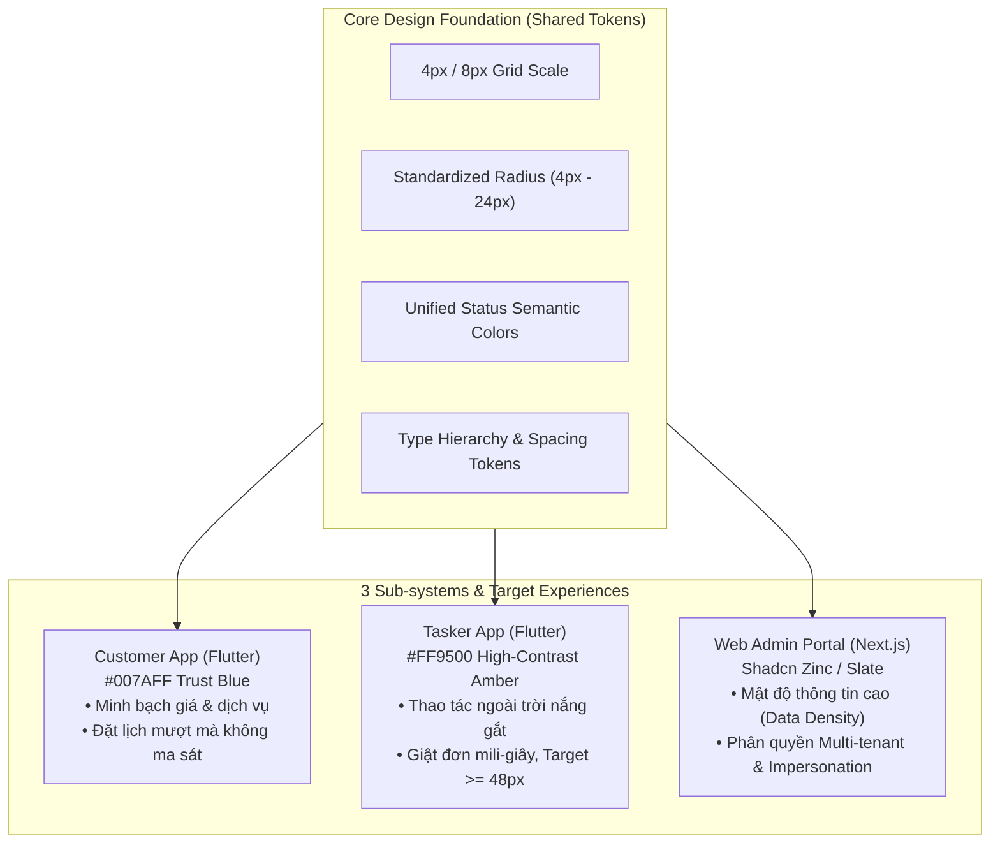

# LinkkWork — Base Design System & UI/UX Specification

- **Dự án:** LinkkWork (On-demand Service Marketplace Platform)
- **Tài liệu tham chiếu:** [2026-10-05-linkkwork-design.md](file:///Users/admin/Desktop/gb/docs/superpowers/specs/2026-10-05-linkkwork-design.md)
- **Phiên bản:** 1.0 (Production-Ready Design System)
- **Ngày hoàn thiện:** 2026-10-05
- **Trạng thái:** APPROVED & READY FOR IMPLEMENTATION

---

## 1. TRIẾT LÝ THIẾT KẾ & ĐỊNH HƯỚNG TRẢI NGHIỆM ĐA NỀN TẢNG (TRI-EXPERIENCE)

LinkkWork vận hành trên 3 đối tượng người dùng với ngữ cảnh môi trường và tâm lý học hành vi (UX Psychology) hoàn toàn khác nhau. Hệ thống thiết kế (Design System) phân tách rõ ràng nhưng duy trì tính đồng nhất về cấu trúc nền tảng:



1. **Customer App — "Trust & Transparency" (Tin cậy & Minh bạch):**
   - Màu chủ đạo: `#007AFF` (iOS System / Trust Blue).
   - Trọng tâm UX: Giao diện trực quan, rõ ràng, minh bạch tuyệt đối về thành phần giá (Base price, Add-ons, Surge, Voucher). Giảm thiểu thao tác nhập liệu, hỗ trợ tra cứu lộ trình thợ thời gian thực.
2. **Tasker App — "Outdoor High-Contrast & Speed" (Tương phản ngoài trời & Siêu tốc):**
   - Màu chủ đạo: `#FF9500` (Outdoor High-Contrast Amber) kết hợp `#28CD41` (Claim Green).
   - Trọng tâm UX: Thợ di chuyển liên tục ngoài đường, xem màn hình dưới ánh nắng mạnh hoặc đội mũ bảo hiểm. Touch target lớn ($\ge 48\text{px}$, nút nhận đơn $\ge 56\text{px}$). Phản hồi rung haptic và âm thanh "ting ting" đặc trưng khi có đơn và khi giật việc thành công.
3. **Web Admin Portal — "Data Density & Situational Awareness" (Mật độ thông tin & Giám sát tức thời):**
   - Màu chủ đạo: Shadcn Neutral Slate/Zinc kết hợp Amber Warning cho Impersonation Mode.
   - Trọng tâm UX: Gọn gàng, tải nhanh, hiển thị bảng dữ liệu nhiều cột (Data Tables), quản lý điều phối Heatmap, phân biệt rạch ròi giữa đơn của Sàn LinkkWork và đơn riêng của từng Tenant.

---

## 2. DESIGN TOKENS CHUẨN HÓA (STANDARDIZED DESIGN TOKENS)

### 2.1. Hệ Màu sắc (Color Tokens)

#### A. Bảng màu Ngữ nghĩa Chung (Shared Semantic Status Colors)
| Semantic Token | Light Mode Hex | Dark Mode Hex | Ý nghĩa sử dụng |
| :--- | :--- | :--- | :--- |
| `color-success-bg` | `#ECFDF5` | `#064E3B` | Nền trạng thái hoàn tất, thanh toán thành công |
| `color-success-fg` | `#059669` | `#34D399` | Text/Icon thành công, thợ đã nhận việc |
| `color-warning-bg` | `#FFFBEB` | `#78350F` | Nền cảnh báo, đơn sắp hết hạn, Impersonation bar |
| `color-warning-fg` | `#D97706` | `#FBBF24` | Text cảnh báo, trạng thái Past-Due |
| `color-danger-bg` | `#FEF2F2` | `#7F1D1D` | Nền lỗi, thợ hủy đơn, vi phạm gian lận |
| `color-danger-fg` | `#DC2626` | `#F87171` | Nút hủy việc, phạt vi phạm, trạng thái Suspended |
| `color-info-bg` | `#EFF6FF` | `#1E3A8A` | Nền thông tin đơn hàng, hướng dẫn check-in |
| `color-info-fg` | `#2563EB` | `#60A5FA` | Text thông tin, đường dẫn tài liệu |

#### B. Bảng màu Customer App (`#007AFF` Trust Blue)
| Token Name | Hex Value | Tên hiển thị | Ứng dụng |
| :--- | :--- | :--- | :--- |
| `customer-primary` | `#007AFF` | Trust Blue | Nút CTA chính, App bar, Active tab, Icon dịch vụ |
| `customer-primary-hover` | `#0056B3` | Deep Blue | Trạng thái nhấn giữ (Active/Pressed state) |
| `customer-primary-soft` | `#EBF3FF` | Ice Blue | Nền thẻ dịch vụ được chọn, Radio checked background |
| `customer-secondary` | `#32ADE6` | Sky Teal | Gradient phụ, badge danh mục con |
| `customer-background` | `#F8FAFC` | Off-White Background | Nền màn hình tổng thể |
| `customer-surface` | `#FFFFFF` | Card Surface | Nền thẻ dịch vụ, BottomSheet, Dialog |
| `customer-border` | `#E2E8F0` | Slate Border | Đường viền card, đường ngăn cách divider |
| `customer-text-primary` | `#0F172A` | Slate 900 Text | Tiêu đề chính, giá tiền tổng, số tiền thanh toán |
| `customer-text-muted` | `#64748B` | Slate 500 Text | Mô tả phụ, đơn vị tính, thời gian dự kiến |

#### C. Bảng màu Tasker App (`#FF9500` Outdoor High-Contrast Amber)
| Token Name | Hex Value | Tên hiển thị | Ứng dụng |
| :--- | :--- | :--- | :--- |
| `tasker-primary` | `#FF9500` | High-contrast Amber | Nhận diện thương hiệu Tasker, thanh đếm ngược Radar |
| `tasker-primary-dark` | `#CC7700` | Deep Amber | Trạng thái pressed, viền thẻ cảnh báo |
| `tasker-claim-green` | `#22C55E` | Fast-Finger Green | Nút "⚡ GIẬT ĐƠN NGAY", Tag thu nhập ròng |
| `tasker-claim-glow` | `rgba(34, 197, 94, 0.4)` | Claim Pulse Glow | Hiệu ứng phát sáng lặp (Pulse) nút giật đơn |
| `tasker-background-day` | `#F3F4F6` | Daylight Grey | Nền chống chói khi ra trời sáng |
| `tasker-background-night`| `#111827` | OLED Power-Save Black | Nền Dark Mode tiết kiệm pin ngoài đường |
| `tasker-surface` | `#FFFFFF` | Surface Day | Nền Radar Job Card (Night: `#1F2937`) |
| `tasker-text-primary` | `#111827` | High-Contrast Black | Số tiền nhận, địa chỉ khách (Night: `#F9FAFB`) |
| `tasker-text-urgent` | `#E11D48` | Rose Red Urgency | Thời gian khẩn cấp, cảnh báo phạt trễ giờ |

#### D. Bảng màu Web Admin Portal (Shadcn Zinc & Slate)
| Token Name | Tailwind / Hex | Ứng dụng |
| :--- | :--- | :--- |
| `admin-background` | `bg-slate-50` (`#F8FAFC`) | Nền tổng thể portal |
| `admin-sidebar` | `bg-slate-900` (`#0F172A`) | Sidebar phân quyền Super Admin / Tenant Admin |
| `admin-sidebar-text` | `text-slate-100` (`#F1F5F9`) | Tên menu, danh mục điều hướng |
| `admin-card` | `bg-white` (`#FFFFFF`) | Bảng KPI stats, Data Table card |
| `admin-border` | `border-slate-200` (`#E2E8F0`)| Đường viền bảng dữ liệu, popover |
| `admin-impersonation-bg`| `bg-amber-400` (`#FBBF24`) | Nền thanh Impersonation Warning Banner |
| `admin-impersonation-text`| `text-slate-950` (`#020617`)| Text cảnh báo trên thanh Impersonation |

---

### 2.2. Hệ Typography (Typography Scale)

LinkkWork chuẩn hóa font chữ hệ thống để đạt tốc độ hiển thị cực nhanh (Zero FOUT):
- **iOS:** SF Pro Display & SF Pro Text.
- **Android:** Roboto & Inter.
- **Web Admin:** Inter / Plus Jakarta Sans.
- **Số liệu & Mã giao dịch:** JetBrains Mono / SF Mono (cho Transaction ID, Tọa độ GPS, Giá tiền).

| Token Scale | Font Size | Line Height | Font Weight | Trọng tâm sử dụng |
| :--- | :--- | :--- | :--- | :--- |
| `display-lg` | 32px | 40px | 700 (Bold) | Tổng tiền BottomSheet, Số dư ví lớn, KPI Hero |
| `heading-1` | 24px | 32px | 700 (Bold) | Tiêu đề màn hình chính, Tên danh mục dịch vụ |
| `heading-2` | 20px | 28px | 600 (Semi-bold) | Tiêu đề Section, Thu nhập trên Radar Job Card |
| `heading-3` | 18px | 24px | 600 (Semi-bold) | Tiêu đề Card, Nút Giật Đơn ("⚡ GIẬT ĐƠN NGAY") |
| `body-lg` | 16px | 24px | 500 (Medium) | Tên thợ, Tên dịch vụ chi tiết, Input text field |
| `body-md` | 14px | 20px | 400 (Regular) | Nội dung mô tả, Row trong Table, Addon subtitle |
| `body-sm` | 12px | 16px | 400 (Regular) | Nhãn phụ, Địa chỉ quận/huyện, Ghi chú cọc ví |
| `caption` | 10px | 14px | 600 (Bold Caps) | Badge trạng thái (ACTIVE, PAID), Countdown SLA |
| `mono-num` | 14px/16px | 20px | 600 (Semi-bold) | Mã đơn `#BK-101`, Tọa độ `10.7769° N`, Số dư ví |

---

### 2.3. Hệ Spacing Scale (4px / 8px Grid System)

Tuân thủ nghiêm ngặt hệ lưới 4px cho micro-spacing và 8px cho layout containers:

| Token | Giá trị | Ứng dụng |
| :--- | :--- | :--- |
| `space-1` | 4px | Khoảng cách icon và text trong badge, dot indicator |
| `space-2` | 8px | Padding nhỏ, khoảng cách giữa các tags/chips |
| `space-3` | 12px | Padding trong input field, gap giữa các row phụ |
| `space-4` | 16px | **Standard Mobile Horizontal Padding**, Card internal padding |
| `space-5` | 20px | Khoảng cách giữa các form input items |
| `space-6` | 24px | Section margin, BottomSheet internal header padding |
| `space-8` | 32px | Khoảng cách giữa các block chức năng lớn |
| `space-10` | 40px | Hero icon container size, Avatar kích thước lớn |
| `space-12` | 48px | **Minimum Touch Target** (Theo chuẩn Accessibility WCAG 2.2 AA) |
| `space-14` | 56px | **Standard CTA Button Height** (Nút Giật Đơn, Nút Đặt Lịch) |
| `space-16` | 64px | Floating Action Bar offset, Bottom navigation bar height |

---

### 2.4. Hệ Bo góc (Border Radius Tokens)

| Token | Giá trị | Áp dụng trên thành phần |
| :--- | :--- | :--- |
| `radius-none` | 0px | Full-bleed map viewport, sticky banners |
| `radius-sm` | 4px | Tag phụ phí, watermark timestamp trên camera overlay |
| `radius-md` | 8px | Input field, Checkbox, Dropdown menu item, Table row hover |
| `radius-lg` | 12px | Service Category Card, Radar Job Card, KPI Stat Card |
| `radius-xl` | 16px | Bo góc trên BottomSheet (`RoundedRectangleBorder(top: 16)`), Dialog |
| `radius-2xl` | 24px | Floating Quick Tag Chips, Search Bar pill container |
| `radius-full` | 9999px | Shutter button camera, User avatar, Circular progress indicator |

---

### 2.5. Hệ Đổ bóng & Nổi khối (Shadow & Elevation Tokens)

| Token Level | Web (Tailwind Box-Shadow) | Flutter Elevation | Ứng dụng |
| :--- | :--- | :--- | :--- |
| `elevation-0` | `none` | `0` | Flat input, static table row |
| `elevation-1` | `0 1px 2px 0 rgba(0, 0, 0, 0.05)` | `1.0` (shadowColor `#00000010`) | Service Card default, Table card |
| `elevation-2` | `0 4px 6px -1px rgba(0, 0, 0, 0.10)` | `3.0` (shadowColor `#00000018`) | Card active, Hover state, Dropdown menu |
| `elevation-3` | `0 10px 15px -3px rgba(0, 0, 0, 0.12)`| `6.0` (shadowColor `#00000020`) | Floating ETA Card trên bản đồ, FAB |
| `elevation-4` | `0 20px 25px -5px rgba(0, 0, 0, 0.15)`| `10.0` (shadowColor `#00000028`)| BottomSheet modal, Rating dialog |
| `elevation-urgent` | `0 0 20px rgba(255, 149, 0, 0.45)` | `8.0` (shadowColor `#FF950070`) | Nút "Giật đơn ngay" đang phát xung radar |

---

### 2.6. Hệ Haptic & Phản hồi Âm thanh (Haptic & Audio Tokens)

1. **Haptic Feedback Patterns (`services/haptic_service.dart`):**
   - `HapticPattern.tap`: `HapticFeedback.lightImpact()` — Khi bấm chọn Addon, tăng giảm giờ làm.
   - `HapticPattern.modalOpen`: `HapticFeedback.mediumImpact()` — Khi mở BottomSheet thanh toán.
   - `HapticPattern.radarBroadcast`: `HapticFeedback.heavyImpact()` lặp chu kỳ 2 nhịp — Khi có đơn mới bắn tới máy thợ.
   - `HapticPattern.claimSuccess`: `HapticFeedback.vibrate()` (Chuỗi 2 rung ngắn 80ms) — Khi CAS Lua script trả về 1 (Giật đơn thành công).
   - `HapticPattern.claimConflict`: `HapticFeedback.heavyImpact()` kết hợp rung giật đôi — Khi nhận mã 409 (Đơn đã có người nhận).

2. **Audio Tokens (`assets/sounds/`):**
   - `sound_radar_alert.wav`: Âm báo tần số cao (800Hz - 1200Hz, âm lượng chuẩn hóa 0dB) phát ngay cả khi thợ để máy trong túi quần khi đang đi đường.
   - `sound_claim_success.wav`: Âm báo "Ting ting" tiền về/nhận ca thành công.
   - `sound_checkin_snap.wav`: Âm chụp ảnh cơ học khi Tasker xác thực hiện trường.

---

## 3. THƯ VIỆN THÀNH PHẦN CỐT LÕI (CORE COMPONENT SPECIFICATIONS)

### 3.1. Customer App Components

```text
┌────────────────────────────────────────────────────────┐
│  CUSTOMER APP COMPONENT BLUEPRINTS                    │
├──────────────────────────┬─────────────────────────────┤
│ 1. Service Category Card │ 2. Addon Selector           │
│ ┌──────────────────────┐ │ ┌─────────────────────────┐ │
│ │ 🧹 Dọn dẹp theo giờ  │ │ │ [x] Mang theo dụng cụ   │ │
│ │ Từ 80.000đ/h   [HOT] │ │ │     Nước tẩy + Cây lau  │ │
│ └──────────────────────┘ │ │     +30.000đ            │ │
│                          │ └─────────────────────────┘ │
├──────────────────────────┴─────────────────────────────┤
│ 3. Transparent Pricing BottomSheet                     │
│    • Dọn dẹp nhà (3 giờ) ................ 240.000đ     │
│    • Mang dụng cụ chuyên dụng ............ +30.000đ    │
│    • Phụ phí giờ cao điểm (x1.2) ........ +54.000đ     │
│    • Voucher GIAM20K ..................... -20.000đ    │
│    ─────────────────────────────────────────────────   │
│    TỔNG THANH TOÁN: 304.000đ   [ ĐẶT LỊCH NGAY ]       │
└────────────────────────────────────────────────────────┘
```

#### A. Service Category Card (`ServiceCategoryCard.dart`)
- **Vị trí:** Màn hình chính Customer Home (`customer_domain`).
- **Kích thước & Layout:** Lưới 2 cột (Grid 2-column) hoặc Cuộn ngang. Chiều cao cố định 140px.
- **Thành phần:**
  * Container: Bo góc `radius-lg` (12px), viền `customer-border` (1px), nền `customer-surface`.
  * Top-Left: Icon vector minh họa 40x40px với background tròn mềm (`#EBF3FF`).
  * Top-Right: Badge "Phổ biến" hoặc "Ưu đãi" (`radius-sm`, nền đỏ nhạt `#FEE2E2`, chữ đỏ `#DC2626`, 10px Caps).
  * Center: Tiêu đề dịch vụ (`body-lg`, 600 Semi-bold, màu `#0F172A`).
  * Bottom: Tag giá sàn ("Từ 80.000đ/giờ", `body-sm`, màu `#007AFF`).

#### B. Addon Selector (`AddonSelectorTile.dart`)
- **Vị trí:** Màn hình cấu hình chi tiết đơn đặt (`customer_domain/booking_flow`).
- **Thành phần:**
  * Left: Checkbox tròn hoặc Stepper (+/-) kích thước 24x24px.
  * Middle Column: Tiêu đề Addon (`body-md`, 600 Semi-bold) + Subtitle mô tả dụng cụ chi tiết.
  * Right: Đơn giá bổ sung: `+30.000đ` (`mono-num`, 14px, màu `#007AFF`, Semi-bold).

#### C. Transparent Pricing BottomSheet (`TransparentPricingSheet.dart`)
- **Vị trí:** Bước cuối cùng trước khi xác nhận đặt dịch vụ.
- **Layout:** BottomSheet chiếm 65% chiều cao màn hình, bo góc trên 16px (`radius-xl`), có drag handle bar 40x4px ở đỉnh.
- **Bóc tách chi tiết:**
  - Giá gốc (Base price theo giờ/số máy)
  - Danh sách Add-ons đã chọn
  - Phụ phí diện tích (> 80m²)
  - Phụ trội cao điểm Surge Multiplier (nếu có)
  - Voucher giảm giá
  - Tổng thanh toán cực đại (`display-lg`, Bold, `#007AFF`)
  - Nút Sticky CTA 56px: "Xác nhận & Tìm Tasker".

#### D. Map Route Tracking (`MapRouteTrackingView.dart`)
- **Vị trí:** Theo dõi thợ đang di chuyển (`ARRIVING`) hoặc đang làm (`IN_PROGRESS`).
- **Thành phần:** Bản đồ tối giản với marker nhà khách, marker thợ di chuyển có bearing rotation, polyline lộ trình, và Floating ETA card cách đáy 24px (tên thợ, xe, số phút dự kiến đến nơi, nút gọi điện và chat nội bộ có filter).

#### E. Rating & Tip Dialog (`RatingAndTipDialog.dart`)
- **Vị trí:** Kích hoạt tự động khi đơn hoàn tất (`COMPLETED`).
- **Thành phần:** 5 sao đánh giá (chạm đổi màu sang vàng kim), quick tags khen ngợi, 4 nút chip chọn nhanh tiền Tip (`[10.000đ]`, `[20.000đ]`, `[50.000đ]`, `[Khác]`), nút text "Không tip", và nút "Gửi đánh giá".

---

### 3.2. Tasker App Components

```text
┌────────────────────────────────────────────────────────┐
│  TASKER APP COMPONENT BLUEPRINTS                      │
├────────────────────────────────────────────────────────┤
│ 1. Radar Job Card (Touch target >= 48px)               │
│ ┌────────────────────────────────────────────────────┐ │
│ │ 🧹 DỌN DẸP THEO GIỜ                    [15s còn lại]│ │
│ │ 📍 1.2 km  •  Phường Tân Định, Quận 1             │ │
│ │ 🕐 14:00 - 17:00 (Hôm nay, 3 giờ)                  │ │
│ │ 💰 THỰC NHẬN: 192.000đ   (Đã trừ 20% hoa hồng)     │ │
│ │ [x] Có dụng cụ   [x] Nhà có mèo                     │ │
│ └────────────────────────────────────────────────────┘ │
├────────────────────────────────────────────────────────┤
│ 2. Fast-Finger Claim Button (>= 56px, Pulse Animation) │
│ ┌────────────────────────────────────────────────────┐ │
│ │          ⚡⚡ GIẬT ĐƠN NGAY (192.000đ) ⚡⚡         │ │
│ └────────────────────────────────────────────────────┘ │
├──────────────────────────┬─────────────────────────────┤
│ 3. Camera Check-in HUD   │ 4. Wallet Balance Card      │
│ ┌──────────────────────┐ │ ┌─────────────────────────┐ │
│ │ GPS: 10.7769°N, 106°E│ │ │ Khả dụng: 650.000đ      │ │
│ │ Sai số: ±6m (HỢP LỆ) │ │ │ Tạm giữ:   80.000đ      │ │
│ │ 2026-10-05 13:58:10  │ │ │ [ NẠP TIỀN ] [ SỔ CÁI ] │ │
│ │ [ TRƯỚC KHI LÀM ]    │ │ └─────────────────────────┘ │
│ └──────────────────────┘ │                             │
└──────────────────────────┴─────────────────────────────┘
```

#### A. Radar Job Card (`RadarJobCard.dart`)
- **Tương phản ngoài trời:** Chữ đen đậm trên nền trắng viền xám sáng, độ tương phản $\ge 7:1$.
- **Thành phần:**
  - Header: Icon dịch vụ + Tên in hoa + Thanh đếm ngược thời gian nhận đơn (Urgency bar co dần trong 15s).
  - Thu nhập thực nhận nổi bật: `💰 THỰC NHẬN: 192.000đ` (xanh lá `#16A34A` Bold).
  - Khoảng cách GPS và khu vực quận/huyện (ẩn số nhà chi tiết trước khi giật đơn).

#### B. Fast-Finger Claim Button (`FastFingerClaimButton.dart`)
- Chiều cao 56px, chữ in hoa đậm `⚡ GIẬT ĐƠN NGAY`, đổ bóng phát sáng lặp lại (Pulse glow).
- Client mutex: Ngắt touch ngay lập tức ở lần chạm đầu tiên để chống nhấn đúp, phản hồi rung haptic và âm thanh khi trúng/trượt đơn.

#### C. Camera Check-in Overlay (`CameraCheckInOverlay.dart`)
- Khung chụp máy ảnh phần cứng trực tiếp (không cho phép chọn ảnh từ gallery).
- Watermark HUD gắn cứng vào ảnh: Tọa độ GPS thực tế, sai số mét, khoảng cách tới nhà khách ($\le 100\text{m}$ mới mở nút chụp), timestamp hệ thống, nhãn `[ẢNH TRƯỚC KHI LÀM]` hoặc `[ẢNH NGHIỆM THU]`.

#### D. Wallet Balance Card (`WalletBalanceCard.dart`)
- Card dốc màu Slate 900 với 2 chỉ số rành mạch:
  - **Số dư khả dụng để nhận đơn:** Hiển thị màu xanh ngọc `#34D399`.
  - **Số dư tạm giữ (Soft-hold):** Hiển thị số tiền đang bị cấn cọc cho các đơn đang chạy.
  - Thanh cảnh báo mức ký quỹ tối thiểu và nút nạp tiền ví.

---

### 3.3. Web Admin Portal Components

```text
┌────────────────────────────────────────────────────────────────────────┐
│  WEB ADMIN PORTAL BLUEPRINTS                                           │
├────────────────────────────────────────────────────────────────────────┤
│ 1. Impersonation Warning Banner (Sticky Top, High-contrast Amber)     │
│ ┌────────────────────────────────────────────────────────────────────┐ │
│ │ ⚠️ ĐANG TRUY CẬP DƯỚI DANH NGHĨA TENANT: CÔNG TY ÁNH DƯƠNG         │ │
│ │ ID: 8f3a-... | Mọi hành động đều được lưu vết kiểm toán            │ │
│ │                                               [ THOÁT ĐẠI DIỆN ]   │ │
│ └────────────────────────────────────────────────────────────────────┘ │
├──────────────────────────┬─────────────────────────────────────────────┤
│ 2. KPI Stat Cards        │ 3. Tenant Table & Status Badges             │
│ ┌──────────────────────┐ │ ┌─────────────────────────────────────────┐ │
│ │ Doanh thu GMV hôm nay│ │ │ Tenant      | Plan | Status    | Action │ │
│ │ 128.450.000 đ        │ │ │ ────────────┼──────┼───────────┼─────── │ │
│ │ ↑ +14.2% so với hôm qua│ │ Ánh Dương   | PRO  | [ ACTIVE ]| [ ... ]│ │
│ └──────────────────────┘ │ │ Vệ Sinh 247 | BASIC| [PAST_DUE]| [ ... ]│ │
│                          │ └─────────────────────────────────────────┘ │
├──────────────────────────┴─────────────────────────────────────────────┤
│ 4. Realtime Dispatch Heatmap                                           │
│    [ Map Viewport: Bản đồ nhiệt độ nóng đơn hàng + Vị trí Tasker ]      │
│    [ Sidebar: Hàng đợi bắn đơn + Nút Can thiệp Điều phối khẩn cấp ]     │
└────────────────────────────────────────────────────────────────────────┘
```

#### A. Impersonation Warning Banner (`impersonation-bar.tsx`)
- Thanh sticky cố định ở đỉnh màn hình (`z-[9999]`), nền vàng hổ phách `bg-amber-400`, chữ đen đậm cảnh báo phiên làm việc đại diện cho Tenant và nút "Thoát Đại Diện" màu đỏ để đưa Super Admin về Tenant LinkkWork mặc định.

#### B. KPI Stat Cards (`kpi-stat-card.tsx`)
- Card chỉ số GMV, tổng đơn giật thành công, thợ online, tỷ lệ hủy đơn với chỉ báo tăng/giảm so với tuần trước.

#### C. Tenant Table & Status Badges (`tenant-data-table.tsx`)
- Bảng đối tác đa thuê bao với Status Badges chuẩn hóa: `ACTIVE` (Xanh lục), `PAST_DUE` (Vàng ân hạn 3-5 ngày), `RESTRICTED` (Cam chặn đơn sàn), `SUSPENDED` (Đỏ tạm khóa).

#### D. Realtime Dispatch Heatmap (`dispatch-heatmap.tsx`)
- Bản đồ nhiệt độ nóng đơn hàng WebGL, vị trí pins của thợ theo trạng thái (rảnh, đang đến, đang làm), và ngăn kéo điều phối khẩn cấp để gán đơn thủ công cứu các ca sắp đến giờ làm.
