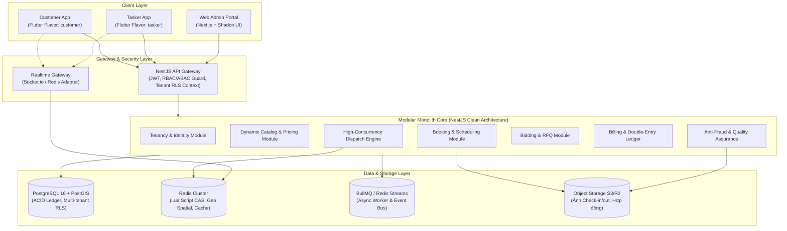
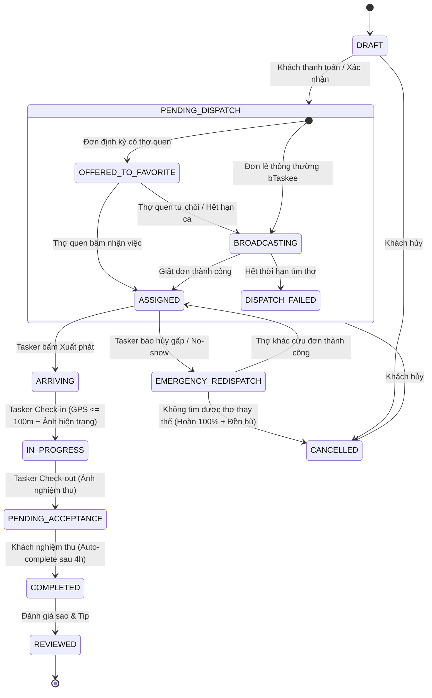
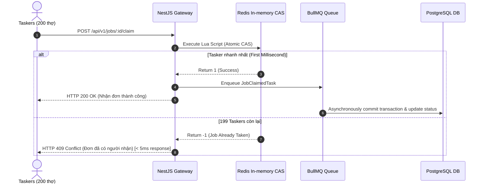
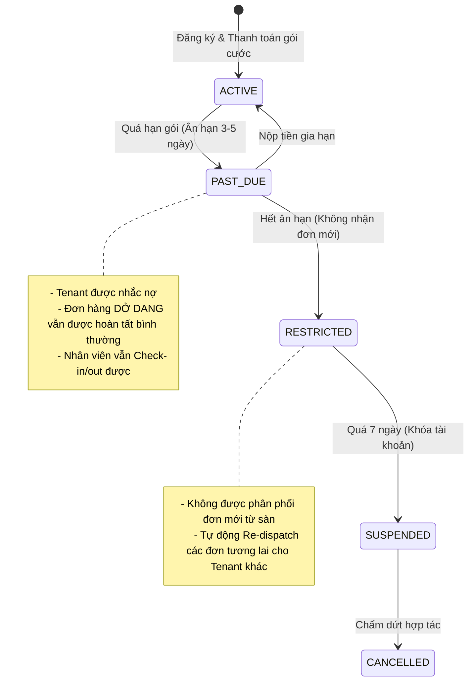
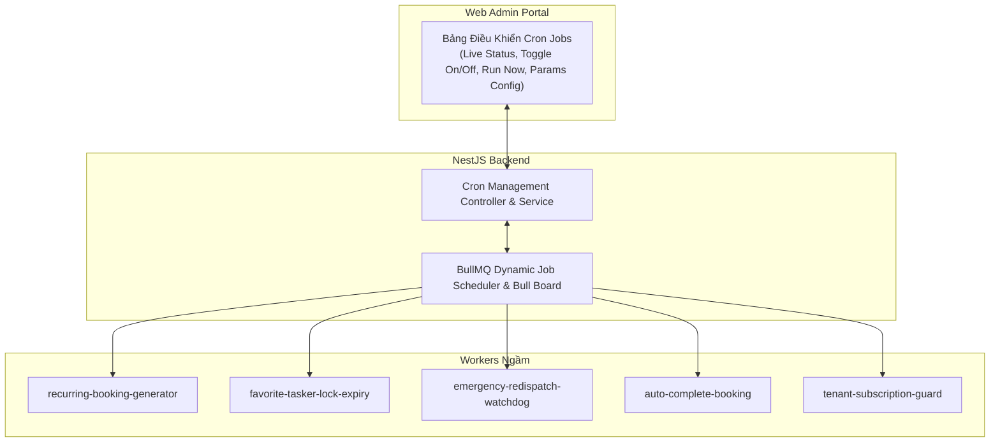

# LinkkWork — System Architecture & Functional Specification Document

- **Dự án:** LinkkWork (On-demand Service Marketplace Platform)
- **Mô hình tham chiếu:** Chuẩn hóa vận hành bTaskee kết hợp Hybrid Multi-tenant Franchise/SaaS
- **Ngày hoàn thiện:** 2026-10-05
- **Phiên bản:** 1.0 (Production-Ready Architecture)
- **Trạng thái:** VALIDATED ARCHITECTURAL DESIGN

---

## 1. TỔNG QUAN HỆ THỐNG & MÔ HÌNH KINH DOANH

### 1.1. Mục tiêu Dự án
Xây dựng nền tảng kết nối dịch vụ tiện ích gia đình & doanh nghiệp theo yêu cầu (On-demand Service Marketplace), tái hiện trọn vẹn và chuẩn hóa mô hình vận hành của **bTaskee**, đồng thời mở rộng năng lực hỗ trợ **Đa doanh nghiệp (Multi-tenancy)**:
1. **Khách hàng (Customer):** Đặt dịch vụ theo giờ, theo thiết bị hoặc đấu thầu dự án lớn; hỗ trợ đặt lẻ và đặt định kỳ chu kỳ dài hạn.
2. **Nhân viên / Đối tác (Tasker):** Nhận đơn linh hoạt qua ứng dụng di động dựa trên thuật toán bắn đơn bTaskee ("giật đơn" nhanh tay mili-giây), quy trình check-in/out bằng ảnh và GPS minh bạch.
3. **Doanh nghiệp dịch vụ (Tenant):** Quản lý đội ngũ nhân sự riêng, điều phối đơn nội bộ, tiếp nhận khách hàng từ sàn hoặc tự khai thác.
4. **Chủ quản nền tảng (Super Admin):** Quản trị toàn bộ sàn, kiểm soát chất lượng, thu phí subscription định kỳ (mặc định) hoặc trích % hoa hồng linh hoạt theo từng Tenant.

### 1.2. Bộ Sản phẩm trong Hệ sinh thái (Product Suite)
* **Web Admin Portal (`apps/admin/`):** 1 website duy nhất sử dụng Next.js / Vite React + Tailwind CSS + Shadcn UI với phân quyền RBAC/ABAC linh hoạt cho Super Admin và Admin Tenant (hỗ trợ Impersonation Mode).
* **Mobile App Suite (`apps/mobile/`):** 1 source code Flutter duy nhất tổ chức theo kiến trúc Monorepo Packages (Melos), build ra 2 ứng dụng độc lập tuyệt đối thông qua Product Flavors & iOS Schemes:
  * `customer`: Bundle ID `com.linkkwork.customer` (App Khách hàng)
  * `tasker`: Bundle ID `com.linkkwork.tasker` (App Nhân viên / Đối tác)
* **Backend Core (`apps/api/`):** NestJS (TypeScript) theo kiến trúc Modular Monolith Clean Architecture, kết hợp PostgreSQL + PostGIS, Redis In-memory CAS và Message Queue (BullMQ).

---

## 2. KIẾN TRÚC TỔNG THỂ & CÁC BOUNDED CONTEXTS



---

## 3. THIẾT KẾ CHI TIẾT CÁC MODULE CHUYÊN SÂU

### 3.1. Tenancy & Identity Module (Quản lý Doanh nghiệp & Phân quyền Đa tầng)

#### A. Phân định Đối tượng & Sở hữu Đơn hàng (Tenant Isolation Model)
Để giải quyết triệt để xung đột giữa đơn hàng công cộng toàn sàn và đơn hàng riêng của Tenant:
* **`origin_tenant_id`:** Doanh nghiệp sở hữu khách hàng hoặc phát sinh đơn hàng (nếu khách vãng lai đặt trên sàn thì `origin_tenant_id = PLATFORM_TENANT`).
* **`servicing_tenant_id`:** Doanh nghiệp trực tiếp nhận và điều phối nhân sự thực thi đơn hàng.
* **Row-Level Security (PostgreSQL RLS):** Tuyến phòng thủ độc lập ở cấp cơ sở dữ liệu:
  ```sql
  ALTER TABLE bookings ENABLE ROW LEVEL SECURITY;
  CREATE POLICY tenant_isolation_policy ON bookings
    USING (
      servicing_tenant_id = current_setting('app.current_tenant_id')::uuid 
      OR origin_tenant_id = current_setting('app.current_tenant_id')::uuid 
      OR current_setting('app.is_super_admin')::boolean = TRUE
    );
  ```

#### B. Phân quyền, Default Tenant LinkkWork & Chế độ Impersonation
* **Default Tenant của Super Admin (Tenant LinkkWork):**
  * Super Admin sở hữu một Tenant mặc định mang tên **Tenant LinkkWork** (`code: 'LINKKWORK'`, `name: 'Nền tảng LinkkWork'`).
  * Khi Super Admin đăng nhập, ngữ cảnh hoạt động mặc định là Tenant LinkkWork. Mọi đơn hàng do tổng đài LinkkWork tiếp nhận hoặc khách vãng lai đặt trên app sàn đều có `origin_tenant_id = LINKKWORK_TENANT_ID`.
  * Super Admin quản lý đội ngũ Tasker tự do của sàn trong phạm vi Tenant LinkkWork này.
  * **Thanh Impersonation Bar:** Cho phép Super Admin chuyển đổi phiên làm việc sang bất kỳ Tenant nào khác để hỗ trợ kỹ thuật hoặc kiểm toán với đầy đủ audit trail.

#### C. Cổng Đăng ký Đối tác Doanh nghiệp (Tenant Partner Onboarding Portal)
* **Form Đăng ký Công khai (`/partner/register`):**
  * Dành cho các công ty, doanh nghiệp dịch vụ địa phương muốn gia nhập sàn.
  * Thông tin thu thập: Tên doanh nghiệp, Mã số thuế, Người đại diện, Số điện thoại hotline, Email, Địa chỉ trụ sở, Tỉnh/Thành phố hoạt động, Các nhóm dịch vụ cung ứng, Ảnh chụp Giấy phép Đăng ký Kinh doanh (ĐKKD).
* **Quy trình Phê duyệt Hồ sơ (Approval Lifecycle):**
  * `SUBMITTED`: Hồ sơ mới gửi, chuyển vào hàng đợi thẩm định của Super Admin.
  * `UNDER_REVIEW`: Super Admin đang liên hệ xác minh thông tin.
  * `APPROVED`: Super Admin phê duyệt -> Hệ thống tự động tạo bản ghi `tenants`, cấp tài khoản `Tenant Admin` đầu tiên và gửi email kích hoạt mật khẩu cho đối tác.
  * `REJECTED`: Từ chối hồ sơ kèm lý do phản hồi để đối tác chỉnh sửa nộp lại.

#### D. Quyền Tạo Đơn & Điều phối Đơn hàng Của Tất Cả Admin (Scoped by Tenant)
* **Tất cả các Admin (Super Admin và mọi Admin Tenant)** đều được trang bị trọn vẹn 2 công cụ nghiệp vụ:
  1. **Công cụ Tạo Đơn Thủ công (Manual Booking Creation):**
     * Dành cho tình huống khách gọi điện thoại trực tiếp qua tổng đài hoặc khách quen của Tenant.
     * Admin nhập: Tên khách, SĐT, Địa chỉ GPS, Chọn dịch vụ, Chọn Add-ons, Chọn thời gian ca làm, Chọn phương thức thanh toán (Tiền mặt / Chuyển khoản).
     * Đơn hàng tự động mang `origin_tenant_id = current_tenant_id` và `servicing_tenant_id = current_tenant_id`.
  2. **Bàn Điều phối Đơn hàng (Tenant Dispatch Console):**
     * Giới hạn phạm vi nghiêm ngặt: Chỉ xem và điều phối các đơn có `servicing_tenant_id = current_tenant_id`.
     * Admin có thể:
       * **Chỉ định trực tiếp (Direct Assignment):** Gán thẳng ca làm cho 1 Tasker nội bộ cụ thể.
       * **Mở nhận việc nội bộ (Internal Broadcast):** Đẩy thông báo cho toàn bộ thợ trực thuộc Tenant của mình vào bấm nhận việc.

---

### 3.2. Dynamic Catalog & Pricing Module (Danh mục Dịch vụ & Động cơ Tính giá Động)

#### A. Danh mục Dịch vụ Chuẩn bTaskee
1. **Dọn dẹp nhà theo giờ (`HOURLY`):** Tính theo thời lượng (2h, 3h, 4h), diện tích mặt sàn, số lượng phòng ngủ/WC.
2. **Vệ sinh máy lạnh (`PER_UNIT`):** Tính theo đầu máy (treo tường, âm trần), công suất (<= 2HP, > 2HP).
3. **Giặt ủi & Vệ sinh sofa/đệm/rèm (`PER_UNIT`):** Tính theo kg quần áo hoặc số lượng chiếc.
4. **Nấu ăn gia đình & Trông trẻ (`HOURLY`):** Tính theo giờ + khẩu phần ăn/số lượng bé.
5. **Tổng vệ sinh công trình sau xây dựng (`BIDDING`):** Khách đăng mặt bằng, hình ảnh để nhận báo giá thầu.

#### B. Động cơ Add-ons & Surge Pricing Formula
$$\text{Total Price} = \left( \text{Base Price}(\text{duration / units}) + \sum \text{Addon Price} + \text{Area Surcharge} \right) \times \text{Surge Multiplier} - \text{Voucher}$$
* **Add-ons tự động gợi ý:**
  * Mang theo dụng cụ vệ sinh chuyên dụng (+30.000đ - 50.000đ).
  * Nước tẩy sinh học / dung dịch khử khuẩn (+20.000đ).
  * Ủi thêm quần áo (+1 giờ công hoặc tính lẻ theo chiếc).
  * Nạp gas máy lạnh bổ sung (R22, R410A, R32).
* **Surge Multiplier (Hệ số cao điểm):** Tự động nhân 1.2x - 1.5x vào khung giờ 17:00 - 20:00, cuối tuần hoặc các dịp Lễ/Tết theo cấu hình của sàn.

---

### 3.3. Booking & Scheduling Module (Quản lý Đơn hàng & Lập lịch Đa tầng)

#### A. Sơ đồ Vòng đời Đơn hàng Chuẩn hóa (Booking State Machine)



#### B. Cơ chế Đặt lịch Định kỳ & Ưu tiên Thợ quen (Recurring Engine)
* **Parent-Child Relation:** Hệ thống lưu trữ `RecurringSubscription` (Hợp đồng gốc) quản lý lịch lặp lại (ví dụ Thứ 2 - 4 - 6 từ 08:00 - 11:00) và tự động sinh các `BookingInstance` (đơn con) trước 48 giờ.
* **Xử lý Khung giờ Thợ quen (Business-hour Aware Window):** 
  * Cửa sổ giữ đơn 6 tiếng cho thợ quen **chỉ được kích hoạt trong giờ làm việc (07:00 - 19:00)** để tránh tình trạng đơn bị hết hạn vào lúc nửa đêm khi thợ đang ngủ.
  * Trước khi gửi đơn cho thợ quen, hệ thống kiểm tra `validateTaskerAvailability()` để loại trừ trường hợp trùng lịch.
  * Nếu thợ quen từ chối một buổi lẻ (do ốm/nghỉ phép), **chỉ buổi đó** được chuyển sang broadcast tìm thợ phụ. Hợp đồng định kỳ tổng thể vẫn duy trì thợ quen cho các buổi tiếp theo.

---

### 3.4. High-Concurrency Dispatch Engine (Động cơ Điều phối "Bắn đơn" Siêu tốc)

#### A. Kiến trúc Bắn đơn Tốc độ cao (Fast-Finger Claiming)
Để chịu tải khi hàng trăm Tasker cùng bấm giật 1 đơn trong vòng 100 mili-giây mà không làm nghẽn PostgreSQL:



#### B. Redis Lua Script thực thi nguyên tử (Atomic Lock & Status Update):
```lua
-- KEYS[1]: job:status:{bookingId}
-- KEYS[2]: tasker:active_job:{taskerId}
-- ARGV[1]: taskerId
-- ARGV[2]: lockExpiryMs (10000)

if redis.call('GET', KEYS[1]) ~= 'OPEN' then
    return -1 -- Đơn đã bị giật hoặc bị hủy
end

if redis.call('EXISTS', KEYS[2]) == 1 then
    return -2 -- Tasker đang vướng một đơn khác trong khung giờ này
end

redis.call('SET', KEYS[1], 'CLAIMED')
redis.call('SET', KEYS[2], ARGV[1], 'PX', ARGV[2])
return 1 -- Thành công giật đơn tuyệt đối!
```

#### C. Tách tầng Lưu trữ Tọa độ GPS (Hot/Cold GPS Ingestion):
* **Hot Storage (Realtime Ingestion):** Tọa độ GPS của 10,000 Tasker gửi lên mỗi 10 giây được nạp trực tiếp vào **Redis Geospatial (`GEOADD taskers:geo:locations lng lat taskerId`)**. Truy vấn thợ trong bán kính $R$ bằng lệnh **`GEOSEARCH`** với độ trễ < 1ms.
* **Cold Storage (Audit / Lộ trình):** Đẩy qua Message Queue để ghi batch vào database phục vụ kiểm toán hoặc giải quyết khiếu nại.

#### D. Kênh Đấu thầu Dịch vụ (Bidding Engine):
* Khách đăng bài thầu (RFQ) -> Hệ thống thông báo tới các Tenant/Tasker trong khu vực.
* Tenant gửi Báo giá (Bids/Quotes) kèm chi tiết vật tư, bảo hành và đơn giá.
* Khi khách hàng bấm "Chấp thuận báo giá", BDM tự động chuyển đổi thành 1 `Booking` chính thức để vận hành quy trình check-in/out, thanh toán và đánh giá chuẩn.

---

### 3.5. Vòng đời Thực thi & Kiểm soát Gian lận (Anti-Fraud & Quality Assurance)

1. **Chống Fake GPS (Mock Location Defense):** Ứng dụng Flutter kiểm tra cờ `location.isFromMockProvider` trên Android và phân tích độ bất thường gia tốc trên iOS; từ chối check-in nếu phát hiện can thiệp GPS.
2. **Bắt buộc Camera Phần cứng (Hardware Camera Enforcement):** Vô hiệu hóa tính năng tải ảnh từ thư viện máy ảnh (`ImageSource.gallery`). Bắt buộc Tasker chụp ảnh trực tiếp tại hiện trường.
3. **Xác thực EXIF & Bán kính:** Hệ thống kiểm tra tọa độ GPS của ảnh và thời gian chụp so với thời điểm gửi request trong dung sai $\pm 60$ giây và khoảng cách $\le 100$ mét so với địa chỉ nhà khách.
4. **Bộ lọc Chống giao dịch ngoài sàn (Disintermediation Chat Filter):** Tích hợp Regex & NLP Filter trong khung chat nội bộ để tự động che số điện thoại, link Zalo, số tài khoản ngân hàng và cảnh báo vi phạm điều khoản sàn.

---

### 3.6. Billing & Double-Entry Ledger Module (Dòng tiền, Sổ cái kép & Phí Nền tảng)

#### A. Thanh toán Tiền công & Ký quỹ Khả dụng (Available Balance Soft Hold)
* Khách thanh toán trực tiếp cho Tenant hoặc Tasker (tiền mặt / chuyển khoản).
* Để chống tình trạng Tasker bùng tiền hoa hồng sàn: Hệ thống yêu cầu Tasker phải có số dư ví khả dụng $\ge$ Tiền hoa hồng ước tính. Ngay khi giật đơn thành công, hệ thống **tạm giữ (SOFT HOLD)** số tiền này. Khi hoàn tất đơn (`COMPLETED`), hệ thống thực hiện trừ dứt điểm (`CAPTURE`).

#### B. Mô hình Sổ cái kép Bất biến (Double-Entry Bookkeeping Ledger)
Mọi biến động tài chính đều được ghi vào bảng `ledger_entries` (Append-only) với nguyên tắc Tổng Nợ (Debit) = Tổng Có (Credit):

| Transaction ID | Tài khoản Nợ (Debit) | Tài khoản Có (Credit) | Số tiền | Nội dung |
| :--- | :--- | :--- | :--- | :--- |
| `TX-2026-001` | `ESCROW_HOLD` | `TASKER_AVAILABLE` | 50.000 đ | Khóa tạm giữ hoa hồng khi nhận đơn #BK-101 |
| `TX-2026-002` | `PLATFORM_REVENUE` | `ESCROW_HOLD` | 50.000 đ | Khấu trừ hoa hồng sàn khi hoàn tất #BK-101 |
| `TX-2026-003` | `TENANT_WALLET` | `PLATFORM_REVENUE` | 2.000.000 đ | Thu phí Gói Subscription Pro tháng 10 của Tenant A |

#### C. Vòng đời Subscription của Tenant (Subscription Grace Period State Machine)



---

### 3.7. Khung Quy định Hủy đơn & Phạt Vi phạm (Cancellation & Penalty SLA)

| Tình huống | Thời điểm | Khách hàng | Tasker / Tenant | Hành động Hệ thống |
| :--- | :--- | :--- | :--- | :--- |
| **Khách hủy đơn** | > 2 giờ trước giờ làm | Miễn phí 100% | Không ảnh hưởng | Hủy đơn, giải phóng lịch Tasker |
| **Khách hủy đơn** | 30 phút - 2 giờ trước giờ làm | Phạt 30% giá trị đơn | Nhận 70% tiền phạt | Cộng tiền bồi thường vào ví Tasker |
| **Khách hủy đơn** | Sau khi Tasker đã "Xuất phát" | Phạt 50% giá trị đơn | Nhận 80% tiền phạt | Bồi thường chi phí đi lại cho Tasker |
| **Tasker hủy đơn** | > 4 giờ trước giờ làm | Không ảnh hưởng | Trừ 2 điểm uy tín | Tự động đưa đơn vào luồng Re-dispatch |
| **Tasker No-show** | Hủy sát giờ (< 1h) hoặc không đến | Hoàn 100% + Voucher đền bù | Phạt 100.000đ + Giảm sao | Kích hoạt Emergency Re-dispatch cứu đơn |

---

### 3.8. Trung tâm Điều khiển & Giám sát Cron Jobs (Cron & Worker Control Center)

Dành riêng cho Super Admin trên Web Admin để điều phối các tiến trình nền tự động:



#### A. Các Tính năng Điều khiển của Super Admin:
1. **Bật / Tắt tức thì (Toggle Enable / Disable):** Cho phép tạm dừng một worker cụ thể ngay lập tức mà không cần khởi động lại Backend server.
2. **Kích hoạt Chạy Ngay (Run Now / Trigger Immediately):** Ép chạy ngay 1 chu kỳ worker (ví dụ sinh đơn bù hoặc đối soát bù dữ liệu).
3. **Cấu hình Tham số Động (Dynamic Runtime Parameters):**
   * Chỉnh sửa biểu thức Cron (`cron_expression`).
   * Thay đổi số giờ sinh đơn định kỳ trước ca làm việc (`advance_hours`, mặc định 48h).
   * Thay đổi thời gian giữ chỗ thợ quen (`favorite_lock_hours`, mặc định 6h trong khung giờ 07:00 - 19:00).
   * Thay đổi thời gian tự động hoàn tất đơn (`auto_complete_hours`, mặc định 4h).
4. **Nhật ký Thực thi & Cảnh báo Sức khỏe (Execution Logs & Live Health):**
   * Theo dõi trạng thái `IDLE`, `RUNNING`, `FAILED`, `PAUSED`.
   * Ghi nhận số lượng bản ghi thành công/thất bại, thời gian chạy và stack trace chi tiết.
   * Tích hợp bảng điều khiển **Bull Board** trực tiếp vào Web Admin.

---

## 4. KIẾN TRÚC MÃ NGUỒN (SOURCE CODE ARCHITECTURE)

### 4.1. Mobile Flutter Monorepo Packages (Melos Workspace Architecture)
Để triệt tiêu hoàn toàn rủi ro rò rỉ mã nguồn Tasker và thuật toán chống gian lận khi biên dịch Customer App:

```text
apps/mobile/
├── melos.yaml
├── packages/
│   ├── core/                      # HTTP Client, Secure Storage, Logger, Base Models
│   ├── design_system/             # UI Components dùng chung (Button, Input, Theme Colors)
│   ├── customer_domain/           # Feature & API chuyên biệt của Khách hàng
│   └── tasker_domain/             # Feature, Radar, Audio Alert & API chuyên biệt của Tasker
├── apps/
│   ├── customer_app/              # Entry: lib/main.dart (Chỉ import core, design_system, customer_domain)
│   └── tasker_app/                # Entry: lib/main.dart (Chỉ import core, design_system, tasker_domain)
```
* **Bảo mật tuyệt đối:** Mã nguồn và DTOs của Tasker không hề tồn tại trong file binary `app-release.apk` của Customer App.
* **Tối ưu dung lượng:** Giảm thiểu bundle size cho cả 2 ứng dụng trên App Store và Google Play.

### 4.2. Web Admin Portal (Next.js / Vite React + Tailwind + Shadcn UI)
```text
apps/admin/
├── src/
│   ├── components/
│   │   ├── layout/               # Dynamic Sidebar, Header, User Nav
│   │   ├── impersonation-bar.tsx # Thanh cảnh báo màu vàng khi Super Admin login vào Tenant
│   │   ├── ui/                   # Shadcn UI primitives (Dialog, Table, Sheet, Toast)
│   ├── features/
│   │   ├── dashboard/            # Thống kê KPI, Heatmap đơn hàng realtime
│   │   ├── tenants/              # Quản lý danh sách Tenant, phê duyệt, thiết lập gói phí
│   │   ├── dispatch-monitor/     # Giám sát điều phối đơn hàng và thợ trực tuyến
│   │   ├── billing/              # Quản lý hóa đơn Subscription, đối soát hoa hồng
│   │   └── audit-logs/           # Lịch sử truy vết mọi thao tác hệ thống
```

---

## 5. KẾ HOẠCH BẢO ĐẢM CHẤT LƯỢNG & KIỂM THỬ (QA & TESTING STRATEGY)

1. **Unit Tests:** Kiểm thử 100% logic tính giá (Pricing Formula), chiết khấu add-ons, và cân bằng sổ cái kép Nợ = Có trong `BillingModule`.
2. **Concurrency Integration Tests (Giật đơn mili-giây):** Sử dụng `k6` mô phỏng 500 Tasker đồng thời gửi yêu cầu giật 1 đơn hàng qua Redis Lua Script; xác nhận chỉ duy nhất 1 Tasker thành công và 499 Tasker còn lại nhận mã lỗi 409 trong < 5ms.
3. **Multi-tenant Leak Tests:** Kiểm thử tự động đảm bảo truy vấn từ Tenant A không bao giờ trả về bất kỳ bản ghi nào thuộc Tenant B.
4. **Anti-Fraud Tests:** Kiểm thử từ chối check-in với tọa độ Mock Location và ảnh có EXIF không hợp lệ.
