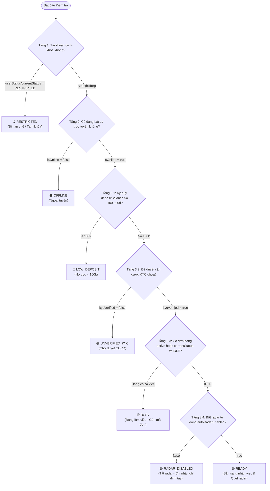
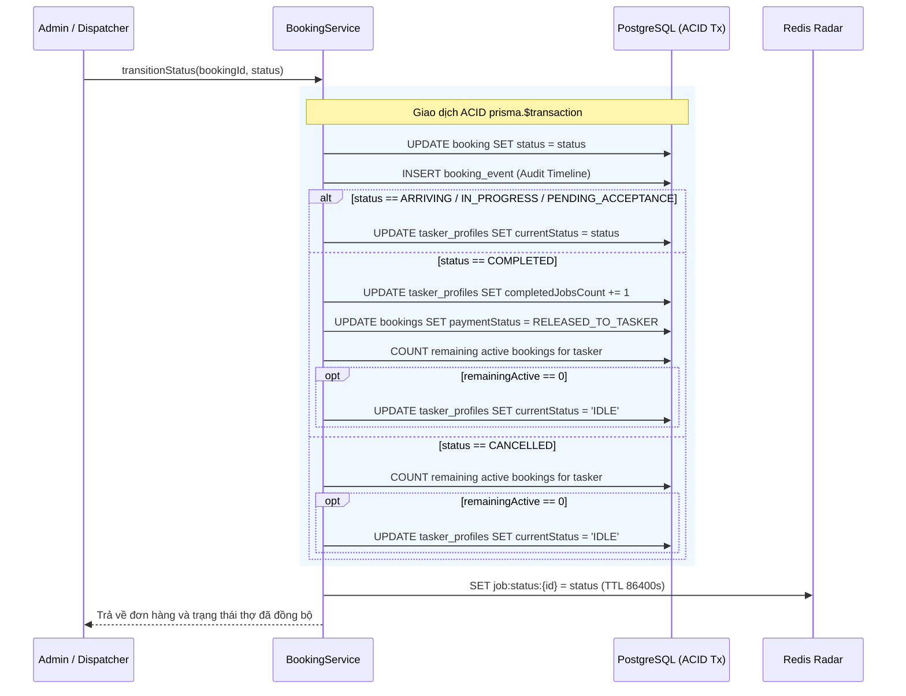

# LinkkWork HRM & Tasker Operations Architecture Specification

- **Document ID:** `SPEC-2026-10-06-HRM-TASKER`
- **Topic:** Phân hệ Quản trị Nhân sự, Đội ngũ Thợ, Động cơ Sẵn sàng 3 Tầng, Đồng bộ Vòng đời ACID & Trang Tài liệu Trực quan
- **Target Applications:** `apps/api` (NestJS) & `apps/admin` (React + Vite)
- **Author:** LinkkWork Core Engineering Team & Docs Maintainer Subagent
- **Status:** Approved / Fully Implemented & Synchronized
- **Version:** 2.4.0 (Live Synchronized)

---

## 1. Executive Summary & Goals

Phân hệ Quản trị Nhân sự & Thợ (HRM & Tasker Operations) là một trong những trụ cột nghiệp vụ thiết yếu của nền tảng LinkkWork. Phân hệ chịu trách nhiệm quản trị toàn bộ vòng đời của người lao động/thợ từ khi gia nhập đối tác (Tenant onboarding), phân bổ kỹ năng chuyên môn, thiết lập sàn làm việc và bán kính nhận đơn, giám sát trạng thái khả dụng thời gian thực qua **Động cơ Sẵn sàng 3 tầng (3-tier Availability Engine)**, quản lý đa ví tài chính (Ký quỹ, Thu nhập khả dụng, Tài khoản ngân hàng, Sổ cái giao dịch bất biến), **đồng bộ hai chiều vòng đời đơn hàng với hồ sơ thợ trong giao dịch ACID**, **theo dõi ca việc đang thực hiện (Active Job Tracking)**, cho tới **Hệ thống Trang Tài liệu Trực quan theo từng Actor (`/system-docs` - `SystemDocsPage.tsx`)**.

### Mục tiêu Cốt lõi:
1. **Đăng ký thợ vào Tenant (Multi-Tenant Tasker Onboarding):**
   - Hỗ trợ Tenant Admin đăng ký nhân viên/thợ trực thuộc đơn vị của mình (`effectiveTenantId`).
   - Super Admin có thể đăng ký thợ cho bất kỳ Tenant nào hoặc thợ tự do thuộc Đội ngũ Sàn toàn quốc.
   - Khởi tạo tài khoản hệ thống `User` (`role: TASKER`) cùng hồ sơ `TaskerProfile`.
2. **Thiết lập Năng lực & Cơ chế Lương (Skill Matrix & Compensation):**
   - Phân bổ danh sách kỹ năng chuyên môn (`skills: String[]`). Chỉ thợ sở hữu kỹ năng tương ứng mới được ghép đơn hàng.
   - Cấu hình cơ chế chia sẻ doanh thu: Hoa hồng theo đơn (`COMMISSION` - mặc định 85/15) hoặc Lương cứng (`FIXED_SALARY`).
3. **Thiết lập Sàn làm việc & Bán kính Quét đơn (Work Floor & Geo-Radius):**
   - Bán kính phục vụ tối đa (`maxDistanceKm`: 1 – 100 km, mặc định 15 km).
   - Quyền nhận việc tự động từ Radar sàn (`autoRadarEnabled: Boolean`) hoặc chỉ nhận điều phối nội bộ trực tiếp.
   - Trạng thái ca trực (`isOnline: Boolean`) và tọa độ làm việc thời gian thực (`currentLat`, `currentLng`).
4. **Mô hình Trạng thái 3 tầng & Động cơ Sẵn sàng (3-Tier Availability Engine):**
   - Đánh giá thời gian thực tính khả dụng của thợ qua 3 tầng phân cấp:
     - **Tầng 1 (Tài khoản):** Kiểm tra cờ hạn chế / kỷ luật (`RESTRICTED`).
     - **Tầng 2 (Ca trực):** Kiểm tra trạng thái trực tuyến / ngoại tuyến (`OFFLINE`).
     - **Tầng 3 (Vận hành & Tài chính):** Kiểm tra ngưỡng ký quỹ tối thiểu (`LOW_DEPOSIT`), căn cước công dân (`UNVERIFIED_KYC`), ca việc đang xử lý (`BUSY`), chế độ radar (`RADAR_DISABLED`), và sẵn sàng nhận việc (`READY`).
5. **Đồng bộ 2 chiều BookingState - TaskerProfile trong ACID Transaction:**
   - Mọi biến động trạng thái đơn hàng (`ASSIGNED`, `ARRIVING`, `IN_PROGRESS`, `PENDING_ACCEPTANCE`, `COMPLETED`, `CANCELLED`) đều cập nhật đồng thời `TaskerProfile.currentStatus` trong cùng giao dịch cơ sở dữ liệu nguyên tử (`prisma.$transaction`).
   - Tự động hoàn trả thợ về `IDLE` khi hoàn thành ca hoặc khi điều phối lại (reassignment) sang thợ khác mà thợ cũ không còn đơn active nào.
   - Cập nhật số đơn hoàn tất (`completedJobsCount`) và kích hoạt quyết toán ví thu nhập (`PaymentStatus.RELEASED_TO_TASKER`).
6. **Theo dõi Ca việc Đang thực hiện (Active Job Tracking):**
   - Tự động gắn kèm cấu trúc `TaskerActiveJob` (mã đơn, dịch vụ, khách hàng, số điện thoại, địa chỉ, số tiền, trạng thái) vào kết quả truy vấn thợ.
   - Hiển thị trực quan trên Web Admin: Huy hiệu trạng thái trên bảng thợ và Thẻ ca việc nổi bật trên Slide-over Drawer với liên kết 1-click sang Bàn Điều Phối (`/dispatch`).
7. **Cơ chế Đa Ví & Sổ cái Giao dịch Kép Bất biến (Multi-Wallet & Financial Ledger):**
   - **Ví Ký Quỹ Đảm Bảo (`depositBalance`)**: Tiền cọc an toàn thợ nạp vào trước để nhận việc. Ngưỡng an toàn tối thiểu là 100.000 VNĐ. Nếu dưới ngưỡng này, hệ thống tự động gắn cờ `LOW_DEPOSIT` và chặn phát sóng / nhận đơn mới.
   - **Ví Thu Nhập Khả Dụng (`walletBalance`)**: Nơi ghi nhận tiền công thực nhận sau khi hoàn tất đơn hàng. Thợ có thể rút về ngân hàng.
   - **Tài khoản Ngân hàng (`bankName`, `bankAccountNumber`, `bankAccountHolder`)**: Lưu trữ thông tin phục vụ chi trả thu nhập.
   - **Sổ cái Bất biến (`WalletTransaction`)**: Mọi biến động nạp, rút, tạm giữ, hoàn cọc đều sinh bản ghi bất biến với số dư trước/sau rõ ràng.
8. **Hệ thống Cảnh báo HRM Thông minh (`HRMAlertsBanner`):**
   - Cảnh báo Ký quỹ không đủ (< 100k): Cảnh báo đỏ, chặn nhận việc, hỗ trợ nút Nạp nhanh.
   - Cảnh báo Chưa xác thực KYC: Cảnh báo vàng, hỗ trợ nút Thẩm định & Duyệt KYC nhanh có bảo vệ xác nhận `useConfirm`.
   - Cảnh báo Đánh giá thấp (< 4.0 sao): Cảnh báo chất lượng dịch vụ để đơn vị can thiệp đào tạo.
   - Bộ lọc 1-click trực tiếp từ Banner cảnh báo.
9. **Trang Trình Diễn Tài Liệu Trực Quan (`/system-docs` - `SystemDocsPage.tsx`):**
   - Trung tâm tri thức số hóa phân tách rõ ràng theo 5 Actors (Super Admin, Tenant Admin, Tasker, Customer, System Engine).
   - Ma trận phân quyền vai trò (RBAC Matrix) và danh mục 16 API endpoints chuẩn hóa có tính năng sao chép 1-click.
10. **Quy chuẩn Docs-as-Code & Subagent Maintainer (Rule 10 CODING_STANDARDS):**
    - Đảm bảo 100% tài liệu kỹ thuật luôn đồng bộ với mã nguồn thực tế, cấm triệt để hiện tượng lệch pha (code drift).

---

## 2. Architecture & Data Contracts

### 2.1. Prisma Schema Modifications (`apps/api/prisma/schema.prisma`)

```prisma
// Enum phân loại biến động số dư tài chính
enum WalletTransactionType {
  TOP_UP_DEPOSIT       // Nạp tiền vào ví ký quỹ
  WITHDRAW_DEPOSIT     // Rút tiền từ ví ký quỹ
  SOFT_HOLD            // Tạm giữ cọc an toàn khi nhận đơn
  HOLD_RELEASE         // Hoàn cọc an toàn khi hoàn thành/nghiệm thu đơn
  ORDER_PAYOUT         // Quyết toán tiền công đơn hàng vào ví thu nhập
  COMMISSION_FEE       // Thu phí hoa hồng nền tảng / đơn vị
  PENALTY_DEDUCTION    // Khấu trừ phạt vi phạm
}

enum WalletTransactionStatus {
  COMPLETED
  PENDING
  FAILED
  REJECTED
}

// Mở rộng TaskerProfile
model TaskerProfile {
  id                 String   @id @default(uuid())
  userId             String   @unique
  tenantId           String
  rating             Float    @default(5.0)
  completedJobsCount Int      @default(0)
  isOnline           Boolean  @default(false)
  currentLat         Float?
  currentLng         Float?
  
  // Năng lực & KYC
  skills             String[] @default([])
  idCardNumber       String?
  kycVerified        Boolean  @default(false)
  
  // Sàn làm việc & Bán kính
  maxDistanceKm      Float    @default(15.0)
  autoRadarEnabled   Boolean  @default(true)
  currentStatus      String   @default("IDLE") // "IDLE" | "ASSIGNED" | "ARRIVING" | "IN_PROGRESS" | "PENDING_ACCEPTANCE" | "RESTRICTED"
  
  // Đa ví & Tài chính
  depositBalance     Float    @default(500000)
  walletBalance      Float    @default(0)
  salaryType         String   @default("COMMISSION") // "COMMISSION" | "FIXED_SALARY"
  
  // Thông tin Ngân hàng nhận lương
  bankName           String?
  bankAccountNumber  String?
  bankAccountHolder  String?
  
  createdAt          DateTime @default(now())
  updatedAt          DateTime @updatedAt

  user               User     @relation(fields: [userId], references: [id], onDelete: Cascade)
  tenant             Tenant   @relation(fields: [tenantId], references: [id], onDelete: Cascade)

  @@index([tenantId])
  @@index([isOnline, currentStatus])
  @@map("tasker_profiles")
}

// Bảng Sổ cái Giao dịch Bất biến (Immutable Financial Ledger)
model WalletTransaction {
  id            String                  @id @default(uuid())
  code          String                  @unique // TX-YYYY-XXXXXX
  tenantId      String
  taskerId      String?
  bookingId     String?
  type          WalletTransactionType
  amount        Float
  direction     String                  // "IN" | "OUT"
  balanceBefore Float
  balanceAfter  Float
  status        WalletTransactionStatus @default(COMPLETED)
  bankName      String?
  bankAccount   String?
  notes         String?
  triggeredBy   String
  createdAt     DateTime                @default(now())

  tenant        Tenant                  @relation(fields: [tenantId], references: [id], onDelete: Cascade)
  tasker        User?                   @relation(fields: [taskerId], references: [id], onDelete: SetNull)
  booking       Booking?                @relation(fields: [bookingId], references: [id], onDelete: SetNull)

  @@index([tenantId])
  @@index([taskerId])
  @@index([bookingId])
  @@map("wallet_transactions")
}
```

---

### 2.2. Backend API Layer (`apps/api/src/modules/tasker` & `booking`)

Cấu trúc module:
- `tasker.module.ts`: Khai báo controller, service, imports Prisma, Tenancy.
- `tasker.controller.ts`: Định tuyến REST endpoints với đầy đủ `@UseGuards(JwtAuthGuard, RolesGuard, TenantContextGuard)`.
- `tasker.service.ts`: Nghiệp vụ HRM, cách ly đa đối tác, sổ cái kép ACID, tích hợp availability và active job.
- `tasker-availability.helper.ts`: Động cơ tính toán trạng thái thợ (`computeTaskerAvailability`) và cấu trúc ca việc (`formatActiveJob`).
- `booking.service.ts`: Quản lý vòng đời đơn hàng, đồng bộ 2 chiều với trạng thái thợ trong `prisma.$transaction`, cung cấp endpoint thợ khả dụng `getAvailableTaskers`.

#### Danh mục REST Endpoints Chuẩn hóa:
1. `POST /api/v1/taskers`: Đăng ký thợ mới, hồ sơ năng lực & bút toán ký quỹ ban đầu (Admin).
2. `GET /api/v1/taskers`: Truy vấn danh sách thợ kèm tính toán availability & ca việc activeJob (Admin).
3. `GET /api/v1/taskers/:id`: Chi tiết thợ, tài khoản ngân hàng, thông tin ca việc đang làm và trạng thái sẵn sàng (Admin/Tasker).
4. `PATCH /api/v1/taskers/:id`: Cập nhật thông tin cá nhân, kỹ năng, tài khoản ngân hàng (Admin).
5. `PATCH /api/v1/taskers/:id/work-floor`: Cấu hình bán kính quét việc (1-100km) & radar tự động (Admin/Tasker).
6. `PATCH /api/v1/taskers/:id/toggle-status`: Bật/tắt ca trực tuyến (`isOnline`) nhận việc (Admin/Tasker).
7. `POST /api/v1/taskers/:id/deposit`: Nạp / Khấu trừ ký quỹ (ghi Sổ cái WalletTransaction trong ACID transaction) (Admin).
8. `PATCH /api/v1/taskers/:id/kyc`: Xác thực căn cước công dân (CCCD) cho thợ (Admin).
9. `GET /api/v1/taskers/:id/transactions`: Lịch sử giao dịch sổ cái kép của thợ (Admin/Tasker).
10. `GET /api/v1/bookings/available-taskers`: Danh sách thợ khả dụng phục vụ điều phối kèm availability & activeJob (Admin).

---

### 2.3. Frontend Web Admin Layer (`apps/admin`)

#### 1. Models & Schemas (`types/index.ts`):
```typescript
export type TaskerAvailabilityCode =
  | 'READY'
  | 'BUSY'
  | 'LOW_DEPOSIT'
  | 'UNVERIFIED_KYC'
  | 'OFFLINE'
  | 'RADAR_DISABLED'
  | 'RESTRICTED';

export interface TaskerAvailability {
  isReadyForDispatch: boolean;
  code: TaskerAvailabilityCode;
  label: string;
  reason: string;
}

export interface TaskerActiveJob {
  bookingId: string;
  bookingCode: string;
  serviceName: string;
  customerName: string;
  customerPhone: string;
  addressText: string;
  status: string;
  scheduledAt: Date | string;
  totalAmount: number;
}

export interface Tasker {
  id: string;
  code: string;
  name: string;
  phone: string;
  email?: string;
  avatarUrl?: string;
  tenantId: string;
  tenantName: string;
  rating: number;
  ratingScore: number;
  completedJobs: number;
  isOnline: boolean;
  walletBalance: number;
  depositBalance: number;
  softHoldBalance: number;
  currentStatus: 'IDLE' | 'ASSIGNED' | 'ARRIVING' | 'IN_PROGRESS' | 'PENDING_ACCEPTANCE' | 'RESTRICTED';
  kycVerified: boolean;
  idCardNumber?: string;
  skills: string[];
  maxDistanceKm?: number;
  autoRadarEnabled?: boolean;
  bankName?: string;
  bankAccountNumber?: string;
  bankAccountHolder?: string;
  availability?: TaskerAvailability;
  activeJob?: TaskerActiveJob | null;
  createdAt?: string;
}
```

#### 2. Components & UI Pages:
- `TaskersPage.tsx`:
  - Bộ thẻ cảnh báo `HRMAlertsBanner` (Ký quỹ thấp, Chờ KYC, Điểm đánh giá yếu).
  - Bộ lọc tabs: Tất cả, Trực tuyến, Ngoại tuyến, Ký quỹ thấp, Chờ KYC.
  - Bảng thợ hiển thị huy hiệu tính khả dụng (🟢 READY, 🟡 BUSY kèm mã đơn, 🔴 LOW_DEPOSIT, 🟠 UNVERIFIED_KYC, ⚫ OFFLINE, 🟣 RADAR_DISABLED, ⛔ RESTRICTED).
- `TaskerDetailDrawer.tsx`:
  - Thẻ "Ca việc đang thực hiện" nổi bật (`ActiveJobCard`) với thông tin khách hàng, số điện thoại, địa chỉ, tổng tiền và nút 1-click chuyển đến Bàn Điều Phối (`/dispatch`).
  - Danh sách checklist 4 tiêu chí sẵn sàng của Động cơ Availability.
  - Lịch sử biến động sổ cái kế toán kép với các mã giao dịch `TX-YYYY-XXXXXX`.
- `SystemDocsPage.tsx`: Trang tài liệu trực quan tương tác phục vụ 5 actors và ma trận RBAC.

---

### 2.4. Mô Hình Trạng Thái Thợ 3 Tầng & Availability Engine

Hệ thống đánh giá tính khả dụng của thợ theo luồng phân cấp tuần tự (Hierarchical Pipeline):



#### Ma trận 7 Mã Khả Dụng (Availability Codes):
| Mã Trạng thái | Nhãn Hiển thị | `isReadyForDispatch` | Ý nghĩa & Hành vi Hệ thống |
| :--- | :--- | :---: | :--- |
| `READY` | 🟢 Sẵn sàng nhận việc | **true** | Đủ điều kiện nhận việc; radar tự động ghép đơn; Admin có thể chỉ định. |
| `BUSY` | 🟡 Đang làm việc | **false** | Thợ đang trong ca (`ASSIGNED`, `ARRIVING`, `IN_PROGRESS`, `PENDING_ACCEPTANCE`); kèm mã đơn hàng. |
| `LOW_DEPOSIT` | 🔴 Nợ cọc (< 100k) | **false** | Số dư ký quỹ < 100.000đ; hệ thống tự động khóa nhận đơn để bảo toàn tài chính. |
| `UNVERIFIED_KYC` | 🟠 Chờ duyệt KYC | **false** | Chưa xác thực CCCD; bị chặn tham gia nhận đơn giá trị cao hoặc đơn quét diện rộng. |
| `OFFLINE` | ⚫ Ngoại tuyến | **false** | Thợ tắt ca trực tuyến; không xuất hiện trên radar quét việc. |
| `RADAR_DISABLED` | 🟣 Tắt radar tự động | **false** | Thợ chỉ nhận đơn khi Admin điều phối bằng tay; không tự động nhận cuốc qua radar. |
| `RESTRICTED` | ⛔ Bị giới hạn / Khóa | **false** | Tài khoản hoặc hồ sơ bị khóa do vi phạm kỷ luật hoặc khiếu nại chất lượng. |

---

### 2.5. Đồng Bộ 2 Chiều Booking Lifecycle - Tasker Status trong ACID Transaction

Để đảm bảo tính nhất quán tuyệt đối giữa trạng thái công việc và nhân sự, LinkkWork thực thi toàn bộ logic chuyển trạng thái trong khối `prisma.$transaction`:



#### Logic Tái Điều Phối (Reassignment):
Khi một đơn hàng được chỉ định lại từ Thợ A sang Thợ B:
1. Thợ B được cập nhật `currentStatus = 'ASSIGNED'`.
2. Hệ thống đếm số đơn hàng active còn lại của Thợ A (`ASSIGNED`, `ARRIVING`, `IN_PROGRESS`, `PENDING_ACCEPTANCE`). Nếu Thợ A không còn đơn nào, tự động hoàn trả Thợ A về `IDLE`.

---

### 2.6. Kiến Trúc Theo Dõi Ca Việc (Active Job Tracking)

- Khi truy vấn danh sách thợ (`getTaskers`) hoặc chi tiết thợ (`getTaskerById`), hệ thống tự động `include` đơn hàng đang hoạt động gần nhất (`assignedBookings` có status `in: [ASSIGNED, ARRIVING, IN_PROGRESS, PENDING_ACCEPTANCE]`).
- Hàm `formatActiveJob(booking)` chuẩn hóa dữ liệu thành đối tượng `TaskerActiveJob`:
  ```typescript
  {
    bookingId: "b83f...c9",
    bookingCode: "BK-2026-90412",
    serviceName: "Vệ sinh máy lạnh treo tường",
    customerName: "Nguyễn Văn A",
    customerPhone: "0901234567",
    addressText: "Tòa A2, Vinhomes Central Park, Bình Thạnh",
    status: "IN_PROGRESS",
    scheduledAt: "2026-10-07T14:00:00Z",
    totalAmount: 350000
  }
  ```
- **Tương tác trên Giao diện:**
  - Bảng thợ hiển thị huy hiệu `BUSY` kèm mã đơn có thể click.
  - Slide-over Drawer hiển thị card màu chàm nổi bật có số điện thoại khách hàng (hỗ trợ `tel:` click-to-call) và nút điều hướng tức thời sang Bàn Điều Phối (`/dispatch?search=BK-2026-90412`).

---

### 2.7. Hệ Thống Trang Tài Liệu Trực Quan (`/system-docs` - `SystemDocsPage.tsx`)

Trang tài liệu trực quan là trung tâm tri thức vận hành toàn diện của nền tảng, tích hợp trực tiếp trên Web Admin Portal:

1. **Phân tách Theo 5 Nhóm Vai Trò (Actors):**
   - **Super Admin:** Thẩm định đối tác doanh nghiệp, phân quyền toàn sàn, điều phối liên sàn, giám sát 4 cron jobs tự động.
   - **Tenant Admin:** Quản trị HRM thợ, phân bổ kỹ năng, nạp/trừ ký quỹ sổ cái, duyệt KYC với `useConfirm`, bàn điều phối đơn.
   - **Tasker (Thợ):** Mô hình trạng thái 3 tầng, 7 mã khả dụng, cơ chế đa ví ký quỹ vs thu nhập, chính sách hoa hồng 85/15 vs lương cứng.
   - **Customer (Khách hàng):** Luồng đặt dịch vụ, snapshot giá cố định máy chủ (Server-side Authoritative Pricing), ví ký quỹ bảo vệ tiền thanh toán (Escrow Protection), nghiệm thu và đánh giá 5 sao.
   - **System Engine:** Thuật toán radar Haversine, khóa nguyên tử Atomic CAS Claim trên Redis, đồng bộ ACID state machine, 4 tiến trình cron nền.
2. **Ma Trận Phân Quyền Vai Trò (Interactive RBAC Matrix):**
   - So sánh trực quan quyền hạn giữa Super Admin, Tenant Admin, Tasker, và Customer trên các nghiệp vụ: Phê duyệt đối tác, Quản trị Cron, Quản trị HRM thợ, Nạp/trừ ký quỹ, Bắn đơn radar, Nghiệm thu chất lượng.
3. **Danh Mục 16 API Endpoints Chuẩn Hóa:**
   - Bộ lọc tìm kiếm thời gian thực theo method, path, quyền hạn và mô tả.
   - Nút sao chép 1-click đường dẫn endpoint vào clipboard.

---

## 3. Business Rules & Financial Integrity

1. **Quy tắc Ký quỹ An toàn (Safe Deposit Policy):**
   - Ngưỡng an toàn tối thiểu: `100,000 VND`.
   - Nếu `depositBalance < 100,000 VND`:
     - Thợ lập tức chuyển sang trạng thái `LOW_DEPOSIT`.
     - Dispatch Console khóa nút phân công đơn cho thợ này kèm tooltip cảnh báo.
     - Radar matching loại thợ này khỏi danh sách nhận tín hiệu phát sóng.
2. **Quy tắc Xác thực Danh tính (KYC Verification Policy):**
   - Thợ chưa xác minh KYC (`kycVerified === false`):
     - Chỉ được nhận các đơn giá trị nhỏ điều phối nội bộ bởi chính Tenant quản lý.
     - Tuyệt đối không được phát sóng đơn toàn sàn hoặc gán đơn giá trị cao (> 2.000.000 VND).
3. **Tính Toàn vẹn của Sổ cái Giao dịch (Ledger Immutability):**
   - Bảng `WalletTransaction` là bất biến: Nghiêm cấm mọi thao tác `UPDATE` và `DELETE`.
   - Mọi điều chỉnh tài chính bắt buộc phải sinh bản ghi mới kèm `balanceBefore`, `balanceAfter`, `notes`, và `triggeredBy`.
4. **Quy tắc Đơn việc Duy nhất (Single Active Job Invariant):**
   - Một thợ tại một thời điểm chỉ được thực hiện tối đa 1 ca việc (`ASSIGNED`, `ARRIVING`, `IN_PROGRESS`, `PENDING_ACCEPTANCE`).
   - Ngăn chặn hoàn toàn tình trạng trùng lịch (double-booking).
5. **Giao dịch Nguyên tử ACID:**
   - Mọi thao tác tài chính và thay đổi trạng thái vòng đời bắt buộc thực hiện trong `prisma.$transaction`. Nếu bất kỳ bước nào thất bại, toàn bộ giao dịch tự động rollback về trạng thái ban đầu.

---

## 4. Verification & Testing Strategy

Toàn bộ hệ thống được bảo vệ bởi bộ kiểm thử tự động toàn diện:

1. **Backend Integration & Unit Tests (`apps/api`):**
   - `test/tasker.spec.ts`: Đăng ký thợ, cách ly tenant (403 Forbidden khi truy cập chéo tenant), nạp cọc sinh giao dịch ledger, duyệt KYC.
   - `src/modules/tasker/tasker.service.spec.ts`: Kiểm thử đơn vị các phương thức `TaskerService`, kiểm tra từ chối rút cọc vượt số dư, kiểm tra hàm `computeTaskerAvailability`.
   - `test/booking.spec.ts`: Kiểm thử toàn bộ 10 trạng thái của Booking State Machine, bắn đơn radar CAS trên Redis, đồng bộ 2 chiều sang `TaskerProfile.currentStatus` và giải phóng thợ về `IDLE`.
   - **Kết quả:** 9/9 test suites, **227/227 tests PASS 100%**.
2. **Frontend Integration Tests (`apps/admin`):**
   - `src/api/tasker-integration.spec.ts`: Kiểm thử toàn bộ luồng live API thợ: đăng ký thợ, truy vấn, nạp cọc, duyệt KYC, kiểm tra từ chối rút âm.
   - `src/schemas/tasker.schema.spec.ts`: Xác thực Zod schemas (createTasker, updateTasker, workFloor, deposit).
   - `src/api/booking-integration.spec.ts`: Kiểm thử chuyển trạng thái vòng đời đơn hàng và nghiệm thu.
   - `src/components/feedback/confirm-integration.spec.ts`: Kiểm thử hộp thoại xác nhận `useConfirm`.
   - **Kết quả:** 4/4 test suites, **82/82 tests PASS 100%**.
3. **Build & Type Safety:**
   - Cả `apps/api` và `apps/admin` biên dịch sạch sẽ (`tsc && vite build`), **0 lỗi TypeScript, zero `any` types**.

---

## 5. Documentation Integrity & Docs-as-Code Standard (Rule 10 CODING_STANDARDS)

- **Triết lý Docs-as-Code:** Tài liệu kỹ thuật hệ thống là tài sản mã nguồn sống (living code artifact). Bất kỳ thay đổi nào trong logic nghiệp vụ, schema, state machine hoặc API đều phải phản ánh đồng thời vào:
  1. Tài liệu kỹ thuật dự án trong thư mục `docs/`.
  2. Trang trình diễn trực quan `SystemDocsPage.tsx` trên Web Admin Portal.
- **Vai trò Subagent `docs-maintainer`:** Subagent được phân công tự động rà soát `git diff`, kiểm tra tính toàn vẹn của tài liệu và cập nhật nội dung tương ứng theo từng Actor (Super Admin, Tenant Admin, Tasker, Customer, System Engine).
- **Cấm Code Drift:** Mọi PR hoặc tính năng mới thiếu cập nhật tài liệu đồng bộ sẽ bị đánh giá là chưa hoàn tất (`INCOMPLETE`).
