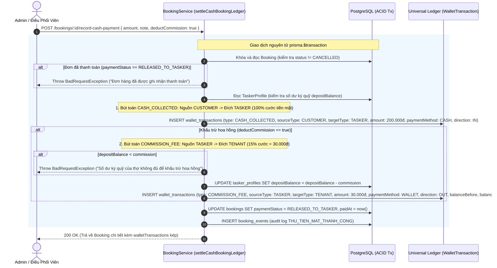

# Tài Liệu Kỹ Thuật: Quy Trình Thanh Toán Tiền Mặt & Sổ Cái Hoa Hồng (Cash Payment Workflow & Commission Ledger)

**Tác giả:** Đội ngũ Kiến trúc Nền tảng LinkkWork  
**Ngày cập nhật:** 07/10/2026  
**Trạng thái:** Triển khai Hoàn tất & Đã Kiểm Thử 100% (Completed & Verified)  
**Quy chuẩn:** Tuân thủ Điều khoản 10 CODING_STANDARDS.md (Docs-as-Code)

---

## 1. Bối Cảnh & Mục Tiêu Nghiệp Vụ

Trong giai đoạn MVP và vận hành thực tế thị trường dịch vụ tại chỗ (home services):
- **Ưu tiên tiền mặt:** Đa số khách hàng thanh toán trực tiếp bằng tiền mặt (Cash On Delivery - COD) cho thợ sau khi nghiệm thu dịch vụ hoàn tất.
- **Tạm hoãn cổng online:** Các cổng thanh toán trực tuyến của bên thứ ba (MoMo, VNPAY, VietQR / Chuyển khoản ngân hàng) chưa triển khai tích hợp trực tiếp, được tạm thời vô hiệu hóa trên toàn bộ giao diện kèm nhãn *"Hiện chưa hỗ trợ"*.
- **Mô hình hoa hồng Grab / bTaskee:**
  - Khách hàng thanh toán **100% cước dịch vụ bằng tiền mặt** cho thợ.
  - Hệ thống ghi nhận trạng thái thanh toán đơn là `RELEASED_TO_TASKER` (do tiền đã về tay thợ trực tiếp).
  - Nền tảng tự động trích thu phí hoa hồng quản lý sàn (**15%** tổng cước đơn hàng) từ **Ví ký quỹ đảm bảo (`depositBalance`)** của thợ.
  - Bút toán kế toán được ghi nhận tức thời và bất biến vào bảng Sổ cái `WalletTransaction` với loại nghiệp vụ `COMMISSION_FEE`.

---

## 2. Kiến Trúc Dữ Liệu (Data Architecture & Schema)

### 2.1. Enum Phương Thức Thanh Toán (`PaymentMethod`)
Được định nghĩa đồng bộ trong `packages/shared-types` và `apps/api/prisma/schema.prisma`:

```prisma
enum PaymentMethod {
  CASH
  MOMO
  VNPAY
  BANK_TRANSFER
}
```

### 2.2. Mở Rộng Model `Booking`
Bổ sung trường lưu phương thức thanh toán và thời điểm thanh toán:

```prisma
model Booking {
  // ... các trường hiện có
  paymentMethod      PaymentMethod @default(CASH)
  paymentStatus      PaymentStatus @default(UNPAID)
  paidAt             DateTime?
  // Quan hệ 1-N với sổ cái kế toán
  walletTransactions WalletTransaction[]
  // ...
}
```

---

## 3. Quy Trình Nghiệp Vụ, Sổ Cái Kép & Sơ Đồ Trạng Thái (Sequence Diagram & Dual-Entry Ledger)

### 3.1. Luồng Ghi Nhận Thu Tiền Mặt Trực Tiếp (`POST /bookings/:id/record-cash-payment`)



### 3.2. Luồng Tự Động Trích Hoa Hồng & Quyết Toán Sổ Cái Kép Khi Nghiệm Thu Hoàn Tất (`transitionStatus` -> `COMPLETED`)
Khi Admin hoặc Khách hàng bấm nghiệm thu hoàn tất đơn (`COMPLETED`) trên Bàn điều phối:
- Nếu đơn hàng **chưa được thanh toán trước đó** (`paymentStatus !== RELEASED_TO_TASKER`), hàm `settleCashBookingLedger` trong ACID Transaction tự động thực hiện:
  1. Chuyển `paymentStatus` sang `RELEASED_TO_TASKER` và gán nhãn thời gian `paidAt = now()`.
  2. **Bút toán 1 (`CASH_COLLECTED`):** Ghi nhận 100% doanh thu cước dịch vụ bằng tiền mặt từ Khách hàng sang Thợ đối tác (`direction: IN`, `paymentMethod: CASH`).
  3. **Bút toán 2 (`COMMISSION_FEE`):** Tính toán hoa hồng sàn (mặc định 15% hoặc theo `servicingTenant.commissionRate`), khấu trừ từ `depositBalance` của thợ và chuyển về doanh nghiệp (`direction: OUT`, `paymentMethod: WALLET`).
  4. Tăng `completedJobsCount` của thợ (+1) và giải phóng thợ về trạng thái `IDLE` (nếu không còn ca việc nào đang thực hiện).

### 3.3. Mô Hình Kế Toán Kép Bất Biến (Dual-Entry Accounting Model)
Hệ thống hạch toán dòng tiền minh bạch, bảo đảm nguyên tắc kiểm toán và không thất thoát số liệu:

| Đặc tính | Bút toán 1: Thu tiền mặt (`CASH_COLLECTED`) | Bút toán 2: Phí hoa hồng sàn (`COMMISSION_FEE`) |
| :--- | :--- | :--- |
| **Loại giao dịch (`type`)** | `CASH_COLLECTED` | `COMMISSION_FEE` |
| **Nguồn tiền (`sourceType` / `sourceName`)** | `CUSTOMER` (Khách hàng đặt dịch vụ) | `TASKER` (Thợ thực hiện đơn) |
| **Đích nhận (`targetType` / `targetName`)** | `TASKER` (Thợ nhận trực tiếp) | `TENANT` (Đơn vị vận hành / Nền tảng) |
| **Phương thức (`paymentMethod`)** | `CASH` (Tiền mặt COD) | `WALLET` (Ví ký quỹ thợ) |
| **Chiều dòng tiền (`direction`)** | `IN` (Vào túi thợ) | `OUT` (Khấu trừ ví ký quỹ) |
| **Biến động số dư ví** | Không đổi (`balanceBefore` = `balanceAfter`) | Trừ hoa hồng (`balanceAfter` = `balanceBefore` - `amount`) |
| **Mục đích kế toán** | Xác nhận doanh thu dịch vụ phát sinh | Xác nhận doanh thu chia sẻ hoa hồng nền tảng |

### 3.4. Tích Hợp Sổ Cái Giao Dịch Chung (`FinanceModule`) & Bàn Tài Chính (`/finance`)
Toàn bộ các bút toán trên được ghi nhận bất biến vào bảng cơ sở dữ liệu `wallet_transactions` và được quản lý tập trung bởi **`FinanceModule`**:
- **API Truy vấn Sổ cái chung (`GET /api/v1/finance/transactions`):** Hỗ trợ tìm kiếm theo từ khóa (mã bút toán `TX-...`, mã đơn `BK-...`, tên khách, tên thợ), bộ lọc loại giao dịch (`type`), phương thức thanh toán (`paymentMethod`), nguồn/đích (`sourceType`, `targetType`), phân trang và cô lập dữ liệu theo Tenant.
- **API Thống kê Tổng quan (`GET /api/v1/finance/summary`):** Tính toán thời gian thực tổng giá trị dịch vụ (GMV), tổng hoa hồng sàn thu được, và tổng quỹ tiền cọc ký quỹ.
- **Bàn Tài Chính Trung Tâm (`/finance`):** Giao diện chuyên trách trên Admin Portal cho phép Super Admin (toàn sàn) và Tenant Admin (nội bộ đơn vị) đối soát dòng tiền, kiểm tra chi tiết chứng từ kép và trích xuất file CSV phục vụ quyết toán.

---

## 4. Đặc Tả Giao Diện Người Dùng (Admin Frontend Specifications)

### 4.1. Tạo Đơn Hàng Mới (`BookingsPage.tsx`)
- **Radio Card Selector:** Người dùng chọn phương thức thanh toán:
  - 💵 **Tiền mặt (CASH):** Phương thức khả dụng duy nhất, được chọn mặc định.
  - 🟣 **Ví MoMo:** Bị vô hiệu hóa (`disabled: opacity-50 cursor-not-allowed`) kèm Badge cảnh báo `Hiện chưa hỗ trợ`.
  - 🔵 **VNPAY:** Bị vô hiệu hóa kèm Badge `Hiện chưa hỗ trợ`.
  - 🏦 **Chuyển khoản (VietQR):** Bị vô hiệu hóa kèm Badge `Hiện chưa hỗ trợ`.

### 4.2. Bàn Điều Phối Trung Tâm (`DispatchPage.tsx`)
- **Nút Hành Động Độc Lập:** Trên Thanh điều phối chi tiết đơn hàng, bổ sung nút **"Ghi nhận thu tiền mặt"** (DollarSign icon).
- **Modal Ghi Nhận Thu Tiền Mặt (`RecordCashPaymentModal.tsx`):**
  - Hiển thị rõ tổng tiền mặt thợ thu từ khách (100%).
  - Hiển thị chi tiết khoản hoa hồng sàn 15% sẽ trích từ ví ký quỹ của thợ.
  - Trường ghi chú thu tiền (mặc định: *"Thu tiền mặt khi hoàn thành dịch vụ"*).
  - Tự động khóa nút xác nhận nếu số dư ký quỹ của thợ không đủ.
- **Modal Nghiệm Thu Hoàn Tất (`CompletionModal.tsx`):**
  - Tích hợp sẵn thông tin thu tiền mặt và hoa hồng khấu trừ ngay trong bước ký biên bản bàn giao và đánh giá sao.
- **Thẻ Sổ Cái Thanh Toán Đơn Hàng (`PaymentLedgerCard.tsx`):**
  - Hiển thị tình trạng thu tiền (Đã thanh toán / Chưa thanh toán), thời điểm thu (`paidAt`).
  - Liệt kê toàn bộ các biến động sổ cái `WalletTransaction` liên quan trực tiếp đến mã đơn hàng (mã giao dịch, số tiền hoa hồng trích, số dư ví trước và sau khấu trừ).

---

## 5. API Contracts

### 5.1. `POST /api/v1/bookings/:id/record-cash-payment`
- **Mô tả:** Ghi nhận thợ đã thu tiền mặt từ khách và tự động quyết toán sổ cái kép (`CASH_COLLECTED` và trích `COMMISSION_FEE` 15% từ ví ký quỹ).
- **Quyền hạn (RBAC):** `SUPER_ADMIN`, `TENANT_ADMIN`.
- **Request Body:**
  ```json
  {
    "amount": 200000,
    "note": "Thu tiền mặt trực tiếp tại nhà khách",
    "deductCommission": true
  }
  ```
- **Response (200 OK):**
  ```json
  {
    "id": "booking-uuid",
    "code": "BK-2026-0001",
    "paymentMethod": "CASH",
    "paymentStatus": "RELEASED_TO_TASKER",
    "paidAt": "2026-10-07T07:15:00.000Z",
    "walletTransactions": [
      {
        "id": "tx-commission-uuid",
        "code": "TX-1760000000-1234",
        "type": "COMMISSION_FEE",
        "sourceType": "TASKER",
        "sourceName": "Nguyễn Văn Thợ",
        "targetType": "TENANT",
        "targetName": "Điện Lạnh Ánh Dương",
        "paymentMethod": "WALLET",
        "direction": "OUT",
        "amount": 30000,
        "balanceBefore": 500000,
        "balanceAfter": 470000,
        "notes": "Phí hoa hồng sàn 15% cho đơn BK-2026-0001"
      },
      {
        "id": "tx-cash-uuid",
        "code": "TX-1760000000-5678",
        "type": "CASH_COLLECTED",
        "sourceType": "CUSTOMER",
        "sourceName": "Trần Thị Khách",
        "targetType": "TASKER",
        "targetName": "Nguyễn Văn Thợ",
        "paymentMethod": "CASH",
        "direction": "IN",
        "amount": 200000,
        "balanceBefore": 500000,
        "balanceAfter": 500000,
        "notes": "Khách hàng thanh toán tiền mặt trực tiếp cho thợ: 200.000 đ"
      }
    ]
  }
  ```

### 5.2. `GET /api/v1/finance/transactions` (Universal Transaction Ledger)
- **Mô tả:** Truy vấn Sổ cái Giao dịch chung toàn hệ thống, có phân quyền Tenant, bộ lọc đa chiều và phân trang.
- **Quyền hạn (RBAC):** `SUPER_ADMIN`, `TENANT_ADMIN`, `TENANT_DISPATCHER`.
- **Query Parameters:**
  - `page`: số trang (mặc định: 1)
  - `limit`: số bản ghi mỗi trang (mặc định: 20)
  - `search`: tìm kiếm theo mã đơn, mã bút toán, tên đối tượng
  - `type`: lọc theo loại giao dịch (`CASH_COLLECTED`, `COMMISSION_FEE`, `TOP_UP_DEPOSIT`, v.v.)
  - `paymentMethod`: lọc theo phương thức (`CASH`, `WALLET`, `BANK_TRANSFER`, v.v.)
  - `sourceType` / `targetType`: lọc theo loại thực thể Nguồn/Đích (`CUSTOMER`, `TASKER`, `TENANT`, `PLATFORM`)
- **Response (200 OK):**
  ```json
  {
    "data": [
      {
        "id": "tx-uuid",
        "code": "TX-1760000000-1234",
        "type": "CASH_COLLECTED",
        "sourceType": "CUSTOMER",
        "sourceName": "Trần Thị Khách",
        "targetType": "TASKER",
        "targetName": "Nguyễn Văn Thợ",
        "paymentMethod": "CASH",
        "direction": "IN",
        "amount": 200000,
        "balanceBefore": 500000,
        "balanceAfter": 500000,
        "status": "COMPLETED",
        "bookingId": "booking-uuid",
        "createdAt": "2026-10-07T07:15:00.000Z"
      }
    ],
    "total": 128,
    "page": 1,
    "limit": 20,
    "totalPages": 7
  }
  ```

### 5.3. `GET /api/v1/finance/summary`
- **Mô tả:** Thống kê tài chính thời gian thực từ cơ sở dữ liệu (GMV, hoa hồng sàn, tổng ký quỹ).
- **Quyền hạn (RBAC):** `SUPER_ADMIN`, `TENANT_ADMIN`, `TENANT_DISPATCHER`.
- **Response (200 OK):**
  ```json
  {
    "totalGMV": 45000000,
    "totalCommission": 6750000,
    "totalDepositInSystem": 12500000,
    "totalTransactions": 128
  }
  ```

---

## 6. Ma Trận Kiểm Thử & Xác Minh (Test Verification Matrix)

| Khu Vực | File Test | Số Ca Kiểm Thử | Trạng Thái |
| :--- | :--- | :---: | :---: |
| **Shared Types** | `packages/shared-types/test/types.spec.ts` | 9 tests | ✅ PASS (100%) |
| **Backend API** | `apps/api/test/booking.spec.ts` (Test Suite 7) | 4 tests | ✅ PASS (100%) |
| **Backend Finance Module** | `apps/api/test/finance.spec.ts` | 8 tests | ✅ PASS (100%) |
| **Backend API Total** | Toàn bộ 10 Test Suites của Backend | 250 tests | ✅ PASS (100%) |
| **Frontend Integration** | `apps/admin/src/api/booking-integration.spec.ts` (Test 11) | 1 test | ✅ PASS (100%) |
| **Frontend Finance Suite** | `apps/admin/src/api/finance-integration.spec.ts` | 6 tests | ✅ PASS (100%) |
| **Frontend Admin Total** | Toàn bộ 4 Test Suites của Admin Portal | 90 tests | ✅ PASS (100%) |
| **TypeScript Compilation**| `apps/admin run build` + `apps/api run build` | 0 errors | ✅ PASS (100%) |
