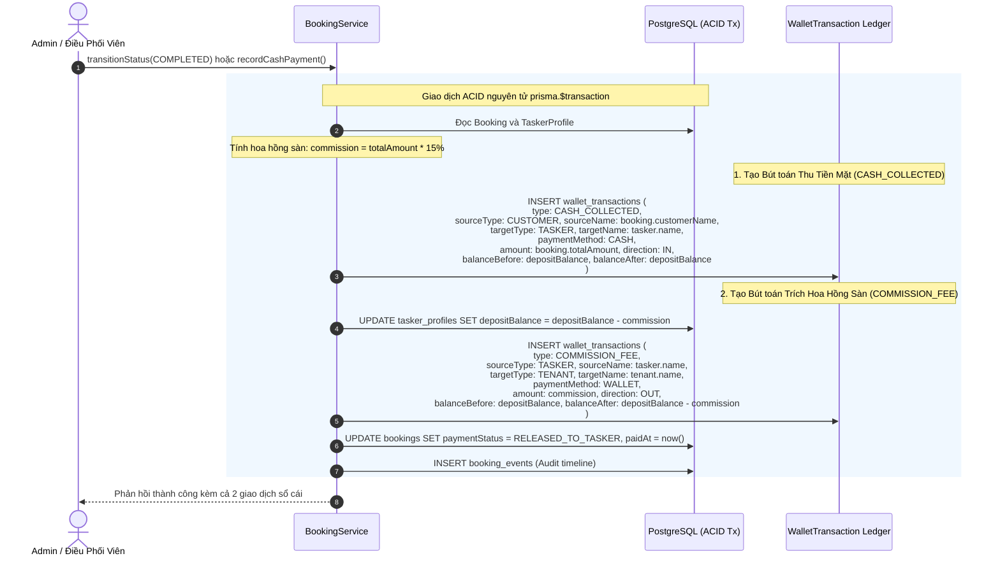

# Tài Liệu Thiết Kế Kỹ Thuật: Sổ Cái Giao Dịch Chung Toàn Hệ Thống (Universal Transaction Ledger)

**Tác giả:** Đội ngũ Kiến trúc Nền tảng LinkkWork  
**Ngày lập:** 07/10/2026  
**Trạng thái:** Đã phê duyệt (Approved)  
**Phân loại:** Kiến trúc Hệ thống (Architectural)  
**Quy chuẩn:** Tuân thủ Điều khoản 10 CODING_STANDARDS.md (Docs-as-Code)

---

## 1. Bối Cảnh & Mục Tiêu Nghiệp Vụ

Trong mô hình vận hành sàn dịch vụ tại chỗ (home services marketplace) với thanh toán tiền mặt COD và trích hoa hồng ký quỹ:
- **Nhu cầu minh bạch dòng tiền:** Toàn bộ các dòng tiền ra/vào giữa Khách hàng, Đối tác thợ và Doanh nghiệp quản lý (Tenant) cần được hạch toán đầy đủ theo nguyên lý kế toán kép (Double-entry / Audit Ledger).
- **Định danh Nguồn và Đích:** Mỗi giao dịch phải chỉ rõ nguồn tiền xuất phát từ ai/thực thể nào (`sourceType`, `sourceName`) và đích đến là ai/thực thể nào (`targetType`, `targetName`), kèm phương thức thanh toán (`paymentMethod`).
- **Mô hình 2 bút toán khi hoàn tất đơn:**
  1. **Bút toán 1 (`CASH_COLLECTED`):** Khách hàng trả 100% tiền mặt cho Thợ (Nguồn: Khách hàng -> Đích: Thợ; Phương thức: `CASH`).
  2. **Bút toán 2 (`COMMISSION_FEE`):** Hệ thống trích thu 15% hoa hồng từ Ví ký quỹ thợ (Nguồn: Thợ -> Đích: Sàn/Tenant; Phương thức: `WALLET`).
- **Truy xuất & Đối soát Trung tâm:** Quản trị viên (Super Admin và Tenant Admin) có một giao diện Sổ cái giao dịch chung (`/finance`), có khả năng tìm kiếm tức thời (Search), lọc đa chiều (Filter by type, payment method, date, tenant, tasker) và xem chi tiết chứng từ.

---

## 2. Kiến Trúc Dữ Liệu & Database Schema

### 2.1. Cập Nhật Enums trong `schema.prisma` và `@linkkwork/shared-types`

```prisma
enum WalletTransactionType {
  CASH_COLLECTED      // [MỚI] Khách hàng thanh toán tiền mặt trực tiếp cho thợ
  COMMISSION_FEE      // Khấu trừ phí hoa hồng sàn từ ví ký quỹ thợ
  TOP_UP_DEPOSIT      // Nạp tiền vào ví ký quỹ bảo đảm
  WITHDRAW_DEPOSIT    // Rút tiền từ ví ký quỹ về ngân hàng
  SOFT_HOLD           // Tạm giữ cọc khi nhận đơn
  HOLD_RELEASE        // Giải phóng cọc tạm giữ
  ORDER_PAYOUT        // Quyết toán thu nhập dịch vụ online
  PENALTY_DEDUCTION   // Phạt vi phạm nghiệp vụ
  SUBSCRIPTION_FEE    // Phí thuê bao gói SaaS tháng
}

enum PaymentMethod {
  CASH
  MOMO
  VNPAY
  BANK_TRANSFER
  WALLET              // [MỚI] Ví ký quỹ / Ví nội bộ hệ thống
}
```

### 2.2. Mở Rộng `model WalletTransaction`

```prisma
model WalletTransaction {
  id            String                  @id @default(uuid())
  code          String                  @unique // TX-YYYY-XXXXXX
  tenantId      String
  taskerId      String?
  customerId    String?                 // Khách hàng phát sinh giao dịch (nếu có)
  bookingId     String?                 // Đơn hàng tham chiếu
  type          WalletTransactionType
  
  // NGUỒN TIỀN (SOURCE)
  sourceType    String                  // "CUSTOMER" | "TASKER" | "TENANT" | "SYSTEM"
  sourceId      String?
  sourceName    String                  // VD: "Khách hàng Nguyễn Văn A", "Ví ký quỹ Thợ Lê Văn B"
  
  // ĐÍCH NHẬN (TARGET / DESTINATION)
  targetType    String                  // "TASKER" | "TENANT" | "SYSTEM" | "BANK"
  targetId      String?
  targetName    String                  // VD: "Thợ Lê Văn B", "Sàn Ánh Dương", "Ngân hàng VCB - 0123..."
  
  // HÌNH THỨC THANH TOÁN
  paymentMethod PaymentMethod           @default(CASH)
  
  // DÒNG TIỀN VÀ SỐ DƯ
  amount        Float
  direction     String                  // "IN" | "OUT"
  balanceBefore Float                   // Số dư ví trước giao dịch
  balanceAfter  Float                   // Số dư ví sau giao dịch
  status        WalletTransactionStatus @default(COMPLETED)
  bankName      String?
  bankAccount   String?
  notes         String?
  triggeredBy   String                  // ID Admin / Tasker / System
  createdAt     DateTime                @default(now())

  tenant        Tenant                  @relation(fields: [tenantId], references: [id], onDelete: Cascade)
  tasker        User?                   @relation("TaskerWalletTransactions", fields: [taskerId], references: [id], onDelete: SetNull)
  customer      User?                   @relation("CustomerWalletTransactions", fields: [customerId], references: [id], onDelete: SetNull)
  booking       Booking?                @relation(fields: [bookingId], references: [id], onDelete: SetNull)

  @@index([tenantId])
  @@index([taskerId])
  @@index([customerId])
  @@index([bookingId])
  @@index([sourceType, targetType])
  @@index([paymentMethod])
  @@map("wallet_transactions")
}
```

---

## 3. Quy Trình Nghiệp Vụ & Sơ Đồ Trạng Thái

### 3.1. Luồng Giao Dịch Khi Nghiệm Thu Hoàn Tất Đơn Hàng Tiền Mặt



---

## 4. Thiết Kế Backend API & Phân Quyền (`FinanceModule`)

### 4.1. Module & Controller
Tạo `FinanceModule` độc lập bao gồm:
- `FinanceController` (`/api/v1/finance`)
- `FinanceService` (`finance.service.ts`)
- Bảo vệ bằng `JwtAuthGuard`, `RolesGuard`, `TenantContextGuard`.

### 4.2. API Query Sổ Cái: `GET /api/v1/finance/transactions`
- **Quyền hạn:** `SUPER_ADMIN`, `TENANT_ADMIN`, `TENANT_STAFF`.
- **Query Parameters:**
  - `search?: string`: Tìm theo mã `code`, `sourceName`, `targetName`, `notes`, `booking.code`.
  - `type?: WalletTransactionType`: Lọc theo loại giao dịch.
  - `paymentMethod?: PaymentMethod`: Lọc theo phương thức (`CASH`, `WALLET`, `BANK_TRANSFER`,...).
  - `tenantId?: string`: Super Admin có thể lọc theo tenant bất kỳ. Tenant Admin bị khóa vào `effectiveTenantId`.
  - `taskerId?: string`: Lọc theo ID thợ.
  - `startDate?: string`, `endDate?: string`: Lọc theo khoảng ngày.
  - `page?: number` (default 1), `limit?: number` (default 10).
- **Response Structure:**
  ```json
  {
    "transactions": [
      {
        "id": "tx-uuid",
        "code": "TX-2026-102934",
        "tenantId": "tenant-anhduong",
        "tenantName": "Ánh Dương Service",
        "taskerId": "tasker-uuid",
        "taskerName": "Lê Văn Thợ",
        "customerId": "cust-uuid",
        "bookingId": "booking-uuid",
        "bookingCode": "BK-2026-0001",
        "type": "CASH_COLLECTED",
        "sourceType": "CUSTOMER",
        "sourceName": "Nguyễn Văn Khách",
        "targetType": "TASKER",
        "targetName": "Lê Văn Thợ",
        "paymentMethod": "CASH",
        "amount": 200000,
        "direction": "IN",
        "balanceBefore": 500000,
        "balanceAfter": 500000,
        "status": "COMPLETED",
        "notes": "Khách hàng thanh toán tiền mặt trực tiếp cho thợ",
        "triggeredBy": "admin-uuid",
        "createdAt": "2026-10-07T10:00:00.000Z"
      }
    ],
    "total": 42,
    "page": 1,
    "limit": 10,
    "summary": {
      "totalCashCollected": 4500000,
      "totalCommissionFee": 675000,
      "totalDepositTopUp": 2000000
    }
  }
  ```

### 4.3. API Thống Kê Tài Chính: `GET /api/v1/finance/summary`
Tính toán số liệu thời gian thực từ cơ sở dữ liệu thay thế hoàn toàn mock data:
- `grossServiceVolume`: Tổng doanh số từ các đơn hoàn tất (`COMPLETED`).
- `platformCommissionEarned`: Tổng hoa hồng sàn đã trích thu từ ví ký quỹ.
- `tenantNetRevenue`: Doanh thu ròng của đối tác.
- `totalDepositHeld`: Tổng số tiền ký quỹ đang được bảo đảm trong hệ thống.

---

## 5. Thiết Kế Giao Diện Web Admin Portal (`/finance`)

### 5.1. Nâng Cấp `FinancePage.tsx`
- **Bộ Lọc Đa Chiều & Tìm Kiếm Tức Thời:**
  - Ô tìm kiếm linh hoạt (Search bar): Hỗ trợ tìm kiếm mã bút toán, tên khách hàng, tên thợ, mã đơn hàng.
  - Dropdown lọc Hình thức thanh toán: *Tất cả*, *💵 Tiền mặt (CASH)*, *👛 Ví ký quỹ (WALLET)*, *🏦 Chuyển khoản*.
  - Tabs phân loại nghiệp vụ:
    - *Tất cả biến động*
    - *Thu tiền mặt (CASH_COLLECTED)*
    - *Hoa hồng sàn (COMMISSION_FEE)*
    - *Ký quỹ thợ (DEPOSIT)*
    - *Quyết toán (PAYOUT)*
- **Bảng Hiển Thị Sổ Cái Kế Toán:**
  - **Mã bút toán & Thời gian:** Mã `TX-...` có badge copy, ngày giờ hiển thị chi tiết.
  - **Nghiệp vụ & Hình thức:** Badge loại giao dịch kèm badge phương thức thanh toán.
  - **Dòng tiền Nguồn ➔ Đích:**
    - Hiển thị trực quan: `👤 [Tên nguồn]` ➔ ➔ `👷 [Tên đích]`.
  - **Mã đơn tham chiếu:** Link click trực tiếp sang Bàn điều phối / Đơn hàng.
  - **Số tiền:** Định dạng số tiền có màu sắc (+ xanh lá / - đỏ hồng).
  - **Số dư ví sau GD:** Hiển thị số dư đối soát.
  - **Trạng thái:** Badge thành công `COMPLETED`.
- **Modal Chi Tiết Bút Toán (`TransactionDetailModal.tsx`):**
  - Xem toàn cảnh 360 độ của 1 bút toán kế toán:
    - Chứng từ gốc (Mã đơn hàng, Dịch vụ).
    - Chủ thể Nguồn và Đích.
    - Biến động số dư chi tiết (`balanceBefore` ➔ `balanceAfter`).
    - Người kích hoạt (`triggeredBy`) và timestamp.

---

## 6. Kế Hoạch Kiểm Thử & Tiêu Chí Nghiệm Thu

1. **Prisma & Shared Types:**
   - Migration cập nhật schema thành công.
   - Test suites `@linkkwork/shared-types` tiếp tục PASS 100%.
2. **Backend API Test Suites:**
   - Viết `finance.service.spec.ts` và `finance.spec.ts` (E2E API test).
   - Kiểm tra đa người dùng (Multi-tenancy): Tenant B Admin không xem được giao dịch của Tenant A; Super Admin xem được toàn sàn.
   - Kiểm tra lưu đúng 2 bút toán khi nghiệm thu đơn tiền mặt.
   - Toàn bộ backend test suites PASS 100%.
3. **Frontend Admin Integration:**
   - Viết test suite `finance-integration.spec.ts` kiểm tra gọi live API `getFinanceTransactions` và `getFinanceSummary`.
   - Admin build sạch 0 lỗi TypeScript.
4. **Docs Synchronization:**
   - Đồng bộ trang `SystemDocsPage.tsx` và ghi nhận endpoint mới vào tài liệu.
