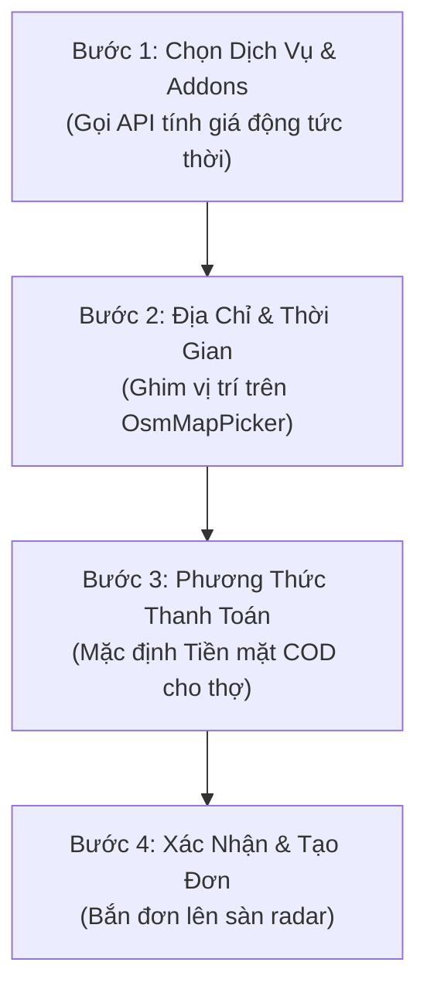
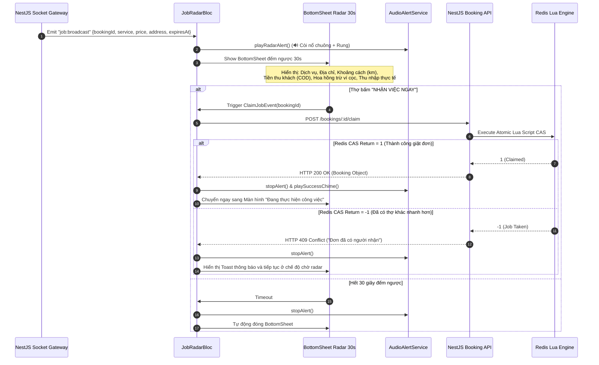

# Đặc Tả Thiết Kế Kiến Trúc: Bộ Ứng Dụng Di Động LinkkWork (Mobile App Suite)

**Ngày ban hành:** 2026-10-08  
**Trạng thái:** Đã phê duyệt (Approved)  
**Phạm vi:** `apps/mobile/` (Khách hàng `customer_app` & Thợ đối tác `tasker_app`)  
**Tác giả:** Antigravity Engineering Team & Lead Architect  

---

## 1. TỔNG QUAN & MỤC TIÊU HỆ THỐNG (EXECUTIVE SUMMARY)

### 1.1. Bối cảnh
Hệ sinh thái LinkkWork đã hoàn thiện nền tảng cốt lõi (Modular Monolith Backend NestJS) và Cổng Quản trị Vận hành (Web Admin Portal) với 349/349 tests pass, quản lý đa doanh nghiệp (Multi-tenancy), động cơ tính giá động (Dynamic Pricing Engine), điều phối đơn hàng radar tốc độ cao (Redis CAS), và trung tâm sổ cái kép toàn hệ thống (Universal Transaction Ledger).

Bước tiếp theo là đưa hệ thống ra thực địa thông qua **Bộ Ứng dụng Di động Đa nền tảng (Mobile App Suite)** phục vụ trực tiếp 2 nhóm người dùng sống còn:
1. **Khách hàng (Customer):** Tự đặt dịch vụ, tính giá động minh bạch tức thì, ghim vị trí bản đồ OpenStreetMap, theo dõi lộ trình và trạng thái thợ tới làm việc theo thời gian thực.
2. **Thợ đối tác (Tasker):** Nhận đơn nổ chuông radar trong bán kính <50ms, bấm giật đơn nguyên tử chống tranh chấp (Atomic Claim Job), thực thi quy trình làm việc 4 bước ngoài hiện trường kèm camera chống gian lận, thu tiền mặt COD và quản lý ví cọc.

### 1.2. Mục tiêu Kỹ thuật (Technical Objectives)
* **Zero Source Code Leakage:** Mã nguồn giật đơn radar, thuật toán kiểm tra chống gian lận (Anti-fraud/Mock GPS) và DTOs nội bộ của Thợ đối tác không bao giờ tồn tại trong file binary của Ứng dụng Khách hàng.
* **Maximum Code Reuse:** Tái sử dụng 100% tầng hạ tầng mạng (`DioClient`, `SocketClient`, `SecureStorage`), Design System (`LinkkUI`), và Mô hình bản đồ (`OsmMapPicker`).
* **Sub-50ms Reaction Speed:** Phản hồi tín hiệu bắn đơn radar và kích hoạt báo động âm thanh (`AudioAlertService`) đếm ngược 30 giây ngay khi có đơn mới.
* **Strict State Machine Alignment:** Toàn bộ vòng đời đơn hàng trên di động tuân thủ tuyệt đối Booking State Machine 13 trạng thái của Backend NestJS.

---

## 2. KIẾN TRÚC MÃ NGUỒN FLUTTER MONOREPO (MELOS WORKSPACE)

Hệ thống được tổ chức trong thư mục `apps/mobile/` theo mô hình **Melos Monorepo Packages**:

```text
apps/mobile/
├── melos.yaml                       # Cấu hình workspace scripts & dependency linking
├── packages/
│   ├── core/                        # Tầng hạ tầng dùng chung (Low-level Foundation)
│   │   ├── pubspec.yaml
│   │   ├── lib/
│   │   │   ├── network/             # Dio HTTP Client, Interceptors (Auth, Refresh Token, Tenant Header)
│   │   │   ├── socket/              # Socket.io Client wrapper, Event Handlers, Auto-reconnect
│   │   │   ├── storage/             # FlutterSecureStorage & Local Cache Preferences
│   │   │   ├── audio/               # AudioPlayer Service phát chuông nổ đơn radar
│   │   │   ├── location/            # Geolocator Service & Chống Mock GPS (Fake Location Detection)
│   │   │   ├── models/              # Shared Domain Enums (BookingStatus, PaymentMethod, UserRole) & DTOs
│   │   │   └── errors/              # AppException, NetworkException, ServerException mapper
│   │   └── test/                    # Unit tests cho Network, Token Rotation, Storage
│   │
│   ├── design_system/               # Thư viện UI chuẩn hóa (LinkkUI)
│   │   ├── pubspec.yaml
│   │   ├── lib/
│   │   │   ├── theme/               # LinkkColors, LinkkTypography, Light/Dark ThemeData
│   │   │   ├── widgets/             # LinkkButton, LinkkInput, LinkkCard, LinkkBadge, Stepper
│   │   │   ├── dialogs/             # Modal xác nhận, BottomSheets, LoadingHUD
│   │   │   └── map/                 # OsmMapPicker & MapRouteWidget (OpenStreetMap + flutter_map)
│   │   └── test/                    # Widget tests cho các thành phần giao diện
│   │
│   ├── customer_domain/             # Tầng nghiệp vụ chuyên biệt của Khách hàng
│   │   ├── pubspec.yaml             # Dependencies: core, design_system
│   │   ├── lib/
│   │   │   ├── auth/                # CustomerAuthBloc, OTP Verification, AddressBook
│   │   │   ├── catalog/             # CatalogBloc, Services, Addons, Dynamic Price Calculation
│   │   │   ├── booking/             # BookingWizardBloc (Form đặt dịch vụ 4 bước)
│   │   │   └── tracking/            # OrderTrackingBloc (Theo dõi thợ di chuyển & trạng thái)
│   │   └── test/                    # BLoC tests cho Booking Flow & Catalog
│   │
│   └── tasker_domain/               # Tầng nghiệp vụ chuyên biệt của Thợ đối tác
│       ├── pubspec.yaml             # Dependencies: core, design_system
│       ├── lib/
│       │   ├── auth/                # TaskerAuthBloc, Trạng thái KYC, Hồ sơ thợ
│       │   ├── status/              # TaskerStatusBloc (Online/Offline, Bán kính radar, Guard ví cọc)
│       │   ├── radar/               # JobRadarBloc (Socket broadcast listener, Còi báo động, Giật đơn CAS)
│       │   ├── execution/           # WorkOrderBloc (4 bước: Xuất phát ➔ Đến nơi ➔ Làm việc ➔ Nghiệm thu)
│       │   └── wallet/              # TaskerWalletBloc (Số dư cọc, Lịch sử sổ cái, Thu tiền mặt COD)
│       └── test/                    # BLoC tests cho Radar Claim Job, Vòng đời ca làm, Ví cọc
│
└── apps/
    ├── customer_app/                # Entrypoint Ứng dụng Khách hàng (iOS & Android)
    │   ├── pubspec.yaml             # Chỉ import: core, design_system, customer_domain
    │   ├── lib/main.dart
    │   └── android/ & ios/
    └── tasker_app/                  # Entrypoint Ứng dụng Thợ đối tác (iOS & Android)
        ├── pubspec.yaml             # Chỉ import: core, design_system, tasker_domain
        ├── lib/main.dart
        └── android/ & ios/
```

---

## 3. TẦNG HẠ TẦNG KẾT NỐI & BẢO MẬT (`packages/core`)

### 3.1. Động cơ Mạng HTTP (`DioClient`)
* **Base URL linh hoạt:**
  * Android Emulator: `http://10.0.2.2:3000/api/v1`
  * iOS Simulator: `http://localhost:3000/api/v1`
  * Môi trường nội bộ / Staging / Production qua file cấu hình biến môi trường (`.env`).
* **Chuỗi Interceptors:**
  1. `AuthInterceptor`: Tự động đính kèm `Authorization: Bearer <accessToken>` từ `FlutterSecureStorage`.
  2. `RefreshTokenInterceptor`: 
     * Bắt mã lỗi `401 Unauthorized`.
     * Khóa hàng đợi request (Queue Lock), tự động gọi API `POST /auth/refresh-token` với `refreshToken`.
     * Lưu cặp token mới vào Keychain/Keystore và tự động thử lại (Retry) request ban đầu bị lỗi.
     * Nếu token không hợp lệ (hết hạn hoặc bị replay defense thu hồi) ➔ Phát sự kiện `AuthSessionExpiredEvent` đưa người dùng về màn hình đăng nhập an toàn.
  3. `TenantHeaderInterceptor`: Gửi `x-tenant-id` khi thợ làm việc dưới quyền đơn vị đối tác cụ thể.

### 3.2. Động cơ Thời gian thực (`SocketClientService`)
* Thư viện: `socket_io_client: ^3.0.0`
* Quản lý kết nối WebSocket với NestJS Gateway (`ws://<host>:3000`):
  * Xác thực thông qua Handshake Auth Token: `auth: {'token': accessToken}`.
  * Tự động Join room theo ID người dùng và khu vực địa lý:
    * Khách hàng: `customer:{userId}`, `booking:{bookingId}`
    * Thợ đối tác: `tasker:{userId}`, `taskers:geo:{zoneId}`
* **Sự kiện lắng nghe (Incoming Events):**
  * `job:broadcast`: Thông báo có đơn mở radar mới trong bán kính (chứa `bookingId`, `serviceName`, `address`, `totalAmount`, `commissionFee`, `expiresAt`).
  * `job:claimed`: Thông báo đơn đã được giật thành công hoặc đã có thợ khác nhận.
  * `booking:status_changed`: Cập nhật trạng thái đơn hàng (`ASSIGNED`, `ARRIVING`, `IN_PROGRESS`, `PENDING_ACCEPTANCE`, `COMPLETED`, `CANCELLED`).
  * `tasker:location_stream`: Truyền tọa độ GPS của thợ di chuyển trực tiếp lên bản đồ khách hàng.

### 3.3. Dịch vụ Âm thanh & Báo động Hiện trường (`AudioAlertService`)
* Thư viện: `audioplayers: ^6.0.0`
* Kích hoạt còi báo động `assets/sounds/radar_alert.mp3` với âm lượng tối đa và lặp lại liên tục khi có event `job:broadcast`.
* Kích hoạt rung giật thiết bị: `HapticFeedback.heavyImpact()` định kỳ 1 giây/lần.
* Tự động dừng phát âm thanh khi thợ bấm "Nhận việc", bấm "Bỏ qua" hoặc hết 30 giây đếm ngược.

### 3.4. Dịch vụ Định vị & Chống Gian lận GPS (`LocationService`)
* Thư viện: `geolocator: ^12.0.0`
* **Kiểm tra Mock Location:** Kiểm tra thuộc tính `position.isMocked` trên Android và độ lệch gia tốc trọng trường trên iOS; lập tức từ chối check-in hiện trường nếu phát hiện ứng dụng Fake GPS.
* **Stream tọa độ nền (Background Location):** Khi đơn ở trạng thái `ARRIVING`, ứng dụng stream tọa độ GPS (tần suất 15-30 giây/lần) gửi về server để hiển thị vị trí thời gian thực.

---

## 4. TẦNG GIAO DIỆN CHUẨN HÓA (`packages/design_system`)

### 4.1. Bảng màu & Typography (LinkkTheme)
* **Primary Brand Color:** Emerald Green (`#10B981` / `#059669`) — Biểu trưng cho sự tin cậy, dịch vụ tận tâm và hoàn tất thành công.
* **Secondary / Surface Color:** Deep Slate Navy (`#0F172A` / `#1E293B`) — Tạo chiều sâu tương phản cho thẻ thông tin và bản đồ.
* **Warning / Alert Color:** Amber Gold (`#F59E0B`) — Dành cho đồng hồ đếm ngược radar 30 giây và trạng thái chờ nghiệm thu.
* **Typography:** Google Fonts `Plus Jakarta Sans` / `Inter`, hỗ trợ đầy đủ tiếng Việt có dấu với phân cấp font rõ ràng (Headline, Title, Body, Caption Monospace).

### 4.2. Thành phần Bản đồ Mã nguồn mở (`OsmMapPicker`)
* Thư viện: `flutter_map: ^7.0.0`, `latlong2: ^0.9.0`
* **Tile Provider:** OpenStreetMap Tile Server (`https://tile.openstreetmap.org/{z}/{x}/{y}.png`) với bộ đệm offline (Cached Tile Provider).
* **Tìm kiếm & Tự động gợi ý địa chỉ (Geocoding):** Tích hợp dịch vụ mã nguồn mở **Nominatim OpenStreetMap API** hỗ trợ tìm kiếm địa chỉ tiếng Việt không cần API Key trả phí:
  * Endpoint: `https://nominatim.openstreetmap.org/search?q={query}&format=json&countrycodes=vn`
* **Tính năng ghim vị trí:** Khách hàng kéo bản đồ để ghim chính xác cửa nhà/tòa nhà, hiển thị địa chỉ chi tiết theo tọa độ Lat/Lng.

### 4.3. Động Cơ Hoạt Ảnh & Chuyển Động Mượt Mà (Fluid Animation & Motion Engine)
Tiêu chí **mượt mà, uyển chuyển (60-120fps)** là tiêu chuẩn bắt buộc số 1 trên toàn bộ các màn hình và widgets:
* **Thư viện chuyển động:** Tích hợp **`flutter_animate: ^4.5.2`** cho toàn bộ micro-interactions, fade-in, scale và shimmer.
* **Tương tác xúc giác đàn hồi (Tactile Tap Feedback):**
  * Mọi `LinkkButton` và `LinkkCard` khi chạm (tap down) tự động thu nhỏ nhẹ (`Transform.scale(scale: 0.97)`) kèm phản hồi rung Haptic (`HapticFeedback.selectionClick()`), khi nhả tay bung êm ái về `1.0` với đường cong `Curves.easeOutCubic`.
* **Danh sách xuất hiện so le (Staggered List Animation):**
  * Khi mở danh mục dịch vụ hoặc lịch sử đơn hàng, từng item lướt nhẹ từ dưới lên với hiệu ứng `FadeEffect(duration: 300.ms)` + `SlideEffect(begin: Offset(0, 0.08), end: Offset.zero)` và độ trễ so le `.delay((index * 40).ms)`.
* **Radar Pulse Animation đa tầng:**
  * Vòng tròn sóng radar tỏa ra liên tục 3 lớp sóng xung kích (`RippleAnimation` mượt mà 60fps) khi thợ ở chế độ bật nhận việc.
* **Hero Transitions:**
  * Chuyển cảnh mượt mà giữa Thumbnail Dịch vụ ở màn hình Home sang Banner Chi tiết dịch vụ không bị giật khựng.
* **Booking Wizard Step Transitions:**
  * Sử dụng `AnimatedSwitcher` với `SharedAxisTransition` / `FadeThroughTransition` khi người dùng chuyển giữa các bước 1 ➔ 2 ➔ 3 ➔ 4.

---

## 5. PHÂN HỆ KHÁCH HÀNG (`packages/customer_domain` & `apps/customer_app`)

### 5.1. Các BLoCs Cốt lõi
* **`CustomerAuthBloc`:** Quản lý đăng nhập SĐT/Mật khẩu/OTP, lưu danh bạ địa chỉ (Nhà, Cơ quan, Người thân).
* **`CatalogBloc`:** Tải danh mục dịch vụ, tải danh sách dịch vụ chi tiết kèm đơn giá theo mô hình tính giá (`HOURLY`, `PER_UNIT`, `BIDDING`).
* **`BookingWizardBloc`:** Quản lý toàn bộ dữ liệu form đặt lịch 4 bước, tự động gọi API `POST /catalog/calculate-price` để hiển thị bảng chiết tính minh bạch.
* **`OrderTrackingBloc`:** Theo dõi đơn hàng thời gian thực qua Socket.io, vẽ lộ trình thợ đang di chuyển trên bản đồ.

### 5.2. Luồng Đặt Dịch Vụ 4 Bước (Booking Wizard)


1. **Bước 1 — Dịch vụ & Addons:**
   * Chọn dịch vụ chính, nhập số lượng / diện tích (m²) / số giờ dự kiến.
   * Chọn các dịch vụ bổ trợ (Addons) kèm theo.
   * Bảng chiết tính giá động thời gian thực hiển thị chi tiết: Giá cơ sở + Phụ phí diện tích + Phụ phí cao điểm - Chiết khấu voucher = **Tổng tiền ước tính**.
2. **Bước 2 — Địa chỉ & Thời gian:**
   * Ghim vị trí nhà trên `OsmMapPicker`.
   * Chọn ngày làm việc và khung giờ bắt đầu ca làm việc.
3. **Bước 3 — Phương thức thanh toán:**
   * Mặc định chọn **Tiền mặt (COD)** thanh toán trực tiếp cho thợ khi hoàn tất công việc.
   * Các phương thức khác (Chuyển khoản, Thẻ) gắn nhãn *"Sắp hỗ trợ"* và tạm thời vô hiệu hóa.
4. **Bước 4 — Xác nhận & Đẩy đơn:**
   * Khách bấm "Đặt dịch vụ ngay" ➔ Gọi `POST /bookings`.
   * Đơn được tạo với trạng thái `PENDING_DISPATCH`, Backend tự động kích hoạt radar `BROADCASTING`.

### 5.3. Màn hình Theo dõi Đơn hàng Thời gian thực (Real-time Tracking)
* Hiển thị Stepper 5 bước:
  1. *Đang tìm thợ:* Hiệu ứng quét radar xung quanh bán kính nhà khách.
  2. *Thợ đã nhận việc:* Hiển thị Avatar, Tên thợ, Số điện thoại, Đánh giá sao của thợ nhận đơn.
  3. *Thợ đang trên đường tới:* Bản đồ OSM hiển thị vị trí thợ đang di chuyển và thời gian dự kiến đến nơi.
  4. *Đang thực hiện công việc:* Đồng hồ đếm thời gian làm việc thực tế.
  5. *Nghiệm thu & Hoàn tất:* Khách hàng xem ảnh chụp kết quả công việc thợ tải lên, thanh toán tiền mặt và chấm điểm đánh giá (Rating & Feedback 1-5 sao).

---

## 6. PHÂN HỆ THỢ ĐỐI TÁC (`packages/tasker_domain` & `apps/tasker_app`)

### 6.1. Các BLoCs Cốt lõi
* **`TaskerAuthBloc`:** Đăng nhập thợ, xem trạng thái định danh KYC, kỹ năng nghề, đơn vị đối tác (Tenant) chủ quản.
* **`TaskerStatusBloc`:** Nút bật/tắt chế độ nhận việc (Online/Offline), cài đặt bán kính nhận việc (1-50km), kiểm tra điều kiện ví cọc an toàn.
* **`JobRadarBloc`:** Quản lý hàng đợi đơn radar, phát chuông nổ đơn `radar_alert.mp3`, đếm ngược 30 giây, gửi lệnh giật đơn nguyên tử (Atomic Claim Job).
* **`WorkOrderBloc`:** Điều khiển 4 bước thực thi công việc ngoài hiện trường, kiểm soát chụp ảnh camera phần cứng chống gian lận.
* **`TaskerWalletBloc`:** Quản lý số dư ký quỹ (`depositBalance`), lịch sử biến động sổ cái kép, xác nhận thu tiền mặt COD từ khách.

### 6.2. Luồng Nổ Đơn Radar & Giật Đơn Nguyên Tử (Atomic Job Claim)


### 6.3. Quy trình Thực thi 4 Bước & Chống Gian Lận (Work Execution)
Tuân thủ nghiêm ngặt Booking State Machine của hệ thống:

```
[ASSIGNED] ──(1. Xuất phát)──> [ARRIVING] ──(2. Đến nơi & Check-in)──> [IN_PROGRESS] ──(3. Nghiệm thu)──> [PENDING_ACCEPTANCE] ──(4. Thu tiền mặt)──> [COMPLETED]
```

1. **Bước 1 — Xuất phát đến nơi (`ASSIGNED ➔ ARRIVING`):**
   * Mở bản đồ chỉ đường tới vị trí nhà khách.
   * Tự động bật chế độ stream tọa độ GPS về server.
2. **Bước 2 — Đến nơi & Check-in (`ARRIVING ➔ IN_PROGRESS`):**
   * **Kiểm tra chống gian lận (Anti-fraud):** Kiểm tra `position.isMocked` từ chối nếu phát hiện Fake GPS.
   * **Bắt buộc chụp ảnh hiện trường:** Sử dụng `camera` phần cứng, không cho phép chọn ảnh từ thư viện (`ImageSource.gallery = disabled`).
3. **Bước 3 — Gửi yêu cầu nghiệm thu (`IN_PROGRESS ➔ PENDING_ACCEPTANCE`):**
   * Chụp 1-3 bức ảnh kết quả hoàn thành công việc gửi lên cho khách hàng và admin kiểm tra.
4. **Bước 4 — Thu tiền mặt COD & Hoàn tất (`PENDING_ACCEPTANCE ➔ COMPLETED`):**
   * Thợ xác nhận đã thu đủ số tiền mặt từ khách.
   * Backend tự động ghi nhận **2 bút toán kế toán kép**:
     * Bút toán 1: `CASH_COLLECTED` (Nguồn: Khách hàng ➔ Đích: Thợ, `direction: IN`, phương thức `CASH`).
     * Bút toán 2: `COMMISSION_FEE` (Nguồn: Thợ ➔ Đích: Sàn/Tenant, `direction: OUT`, phương thức `WALLET`, tự động khấu trừ ví cọc thợ).

### 6.4. Quản lý Ví Ký Quỹ & Sổ Cái Biến Động (`TaskerWalletBloc`)
* **Thẻ Số dư khả dụng:** Hiển thị số dư ví cọc và tổng thu nhập trong ngày.
* **Bộ lọc sổ cái:** Thợ xem danh sách lịch sử biến động số dư chi tiết: Tiền mặt thu của ai, Hoa hồng sàn trừ đơn nào, Nạp/rút tiền cọc.
* **Cảnh báo thiếu cọc:** Khi số dư ví cọc < mức tối thiểu (ví dụ 50.000đ), hệ thống hiển thị banner cảnh báo và khóa chế độ Online nhận việc, cung cấp thông tin tài khoản ngân hàng để thợ chuyển khoản nạp cọc.

---

## 7. CHIẾN LƯỢC KIỂM THỬ ĐA TẦNG (TESTING STRATEGY)

Hệ thống tuân thủ phương pháp phát triển có kiểm thử nghiêm ngặt:

1. **Unit & BLoC Testing (`bloc_test`, `mocktail`):**
   * Kiểm thử 100% các BLoCs: `CustomerAuthBloc`, `BookingWizardBloc`, `OrderTrackingBloc`, `TaskerStatusBloc`, `JobRadarBloc`, `WorkOrderBloc`, `TaskerWalletBloc`.
   * Mô phỏng đầy đủ các kịch bản biên: Giật đơn thành công (200), đơn bị cướp (409), hết phiên đăng nhập (401 tự động refresh token), lỗi mạng đột xuất (Offline cache).
2. **Widget & Component Testing (`flutter_test`):**
   * Kiểm thử các thành phần UI dùng chung trong `design_system`: `LinkkButton`, `LinkkInput`, `OsmMapPicker`, BottomSheet đếm ngược 30 giây.
3. **E2E Contract Testing với Live Backend:**
   * Kiểm thử tích hợp từ App di động gọi trực tiếp vào NestJS API đang chạy live trên port 3000: Tạo đơn ➔ Radar bắn socket ➔ Thợ giật đơn ➔ Chuyển đổi trạng thái ➔ Thu tiền mặt COD ghi nhận vào Sổ cái chung.

---

## 8. LỘ TRÌNH THỰC THI 5 CỘT MỐC (IMPLEMENTATION MILESTONES)

* **Milestone 1 — Khởi tạo Hạ tầng Workspace & Melos:**
  * Thiết lập Flutter SDK & Melos CLI trên máy chủ phát triển.
  * Khởi tạo cấu trúc `apps/mobile/melos.yaml`, 4 packages (`core`, `design_system`, `customer_domain`, `tasker_domain`) và 2 runner apps (`customer_app`, `tasker_app`).
* **Milestone 2 — Triển khai Packages `core` & `design_system`:**
  * Xây dựng `DioClient` (Interceptors, Token refresh), `SocketClient`, `SecureStorage`, `AudioAlertService`, `LocationService`.
  * Xây dựng `LinkkTheme`, các UI widgets cơ bản và `OsmMapPicker` (OpenStreetMap).
  * Viết Unit tests cho `core` và Widget tests cho `design_system`.
* **Milestone 3 — Triển khai Phân hệ Thợ Đối tác (`tasker_domain` & `tasker_app`):**
  * Xây dựng Auth, Status Online/Offline, Radar BLoC, Còi nổ chuông, Màn hình giật đơn đếm ngược 30 giây.
  * Xây dựng luồng thực thi 4 bước ngoài hiện trường kèm camera chống gian lận.
  * Xây dựng phân hệ ví ký quỹ và sổ cái lịch sử giao dịch.
* **Milestone 4 — Triển khai Phân hệ Khách hàng (`customer_domain` & `customer_app`):**
  * Xây dựng Auth, Danh mục dịch vụ, Động cơ tính giá động client.
  * Xây dựng Booking Wizard đặt lịch 4 bước và màn hình theo dõi đơn hàng thời gian thực.
* **Milestone 5 — Kiểm thử Tích hợp Toàn diện (E2E) & Đồng bộ Tài liệu:**
  * Kiểm thử luồng khép kín giữa Khách hàng, Thợ đối tác và Admin Dashboard.
  * Đồng bộ tài liệu hệ thống `SystemDocsPage` và hoàn thiện spec.
